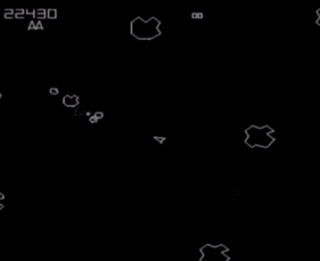

# Asteroids

Odkazy které by se vám mohli hodit:

- [wikipedie](https://cs.wikipedia.org/wiki/Asteroids_(videohra))

Loď se otáčí, zrychluje plynem a střílí. Velké asteroidy se rozbijí na dvě menší, okraje displeje jsou propojené (wrap).

- **tip**: vektorová fyzika je klíčová, kolizní detekce mezi polygonem lodě a polygonem asteroidu
- **bonus**: skóre dle velikosti asteroidu, životy, barevné velikosti
- **velký bonus**: nepřátelské lodě, úrovně s rostoucí obtížností
