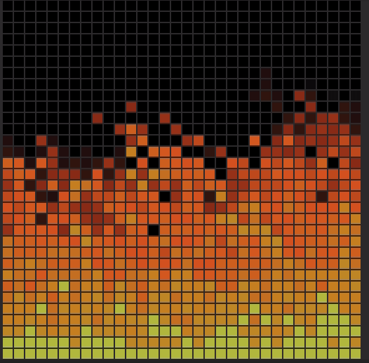

# Simulace ohně - DOOM

Odkazy které by se vám mohli hodit:

- [jak byl oheň v DOOMu dělaný](https://fabiensanglard.net/doom_fire_psx/)

Každý pixel má teplotu (0-255), teplota se šíří dolů na displeji s náhodnou variací.

- **tip**: použij lookup tabulku 37 barev
- **bonus**: vítr ovlivňuje směr šíření, padající popel, materiály (dřevo hoří, voda hasí)
- **velký bonus**: fluid-based simulace, částicový systém jisker, dynamické osvětlení okolí, čtyřfázový model (zahřívání>zapálení>hoření>uhasení)
