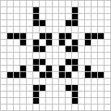

# Game of life - hra života

Cellular automaton, kde se živé buňky rodí a umírají podle jednoduchých pravidel.

Odkazy které by se vám mohli hodit:

- [wikipedie](https://cs.wikipedia.org/wiki/Hra_života)

Každá buňka má 8 sousedů. A každá buňka se rozhoduje podle těchto pravidel

- živá buňka s **méně než 2** živými sousedy - zemře 
- živá buňka se **2 nebo 3** živými sousedy - přežije 
- živá buňka s **více než 3** živými sousedy - zemře 
- mrtvá buňka s **přesně 3** živými sousedy - ožije

 

**tip**: místo rychlosti celé simulace můžeš mít jen dvě generace pro porovnání  
**bonus**: barevný věk buněk, vzory (glider, pulsar, gosper gun), detekce stability  
**velký bonus**: spojit okraje, interaktivní uvládání (zoom, pauza, pokládání buňek..)
