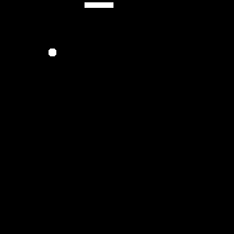

# Snake - had

Většina z vás hada někdy ve svěm životě hrála, ale zkoušeli jste si ho někdy vytvořit?

Odkazy které by se vám mohli hodit:

- [wikipedie](https://cs.wikipedia.org/wiki/Snake)

Má pár základních pravidel

- hlavu ovládáme kam má jít, ale nemůže se na místě otočit o 180°
- když sní jídlo tak se jeho délka o jeden "bod" prodlouží
- když hlava narazí do těla tak hra skončila
- u stěn si můžete vybrat jestli náraz znamená konec hry, nebo že se objeví na druhé straně mapy

- **bonus**: Zobrazuj score a high-score nahoře na displeji. Můžeš použít i `keyvalue` modul pro ukládání hodnot mezi restarty
- **velký bonus**: Místo člověka ovládá had algoritmus. Zkus **Wall Follower**, ** A* ** nebo dokonce Hamiltonovský cyklus pro maximální délku
