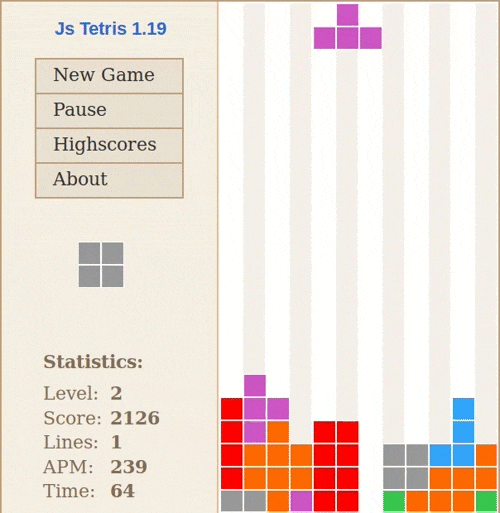

# Tetris

Klasická hra s padajícími díly, kterou určitě všichni zdáte

Odkazy které by se vám mohli hodit:

- [wikipedie](https://cs.wikipedia.org/wiki/Tetris)

Základní herní plocha 10×20, 7 tvarů (I,O,T,L,J,S,Z), rotace, plné řady se mažou.

**bonus**: "ghost piece" zobrazí, kam blok dopadne 
**bonus**: 7-bag randomizér, level systém, high-score mezi spuštěníma 
**velký bonus**: možnost podržení dílu, ukázka dalšího dílu, T-spin detekce, Hard Drop