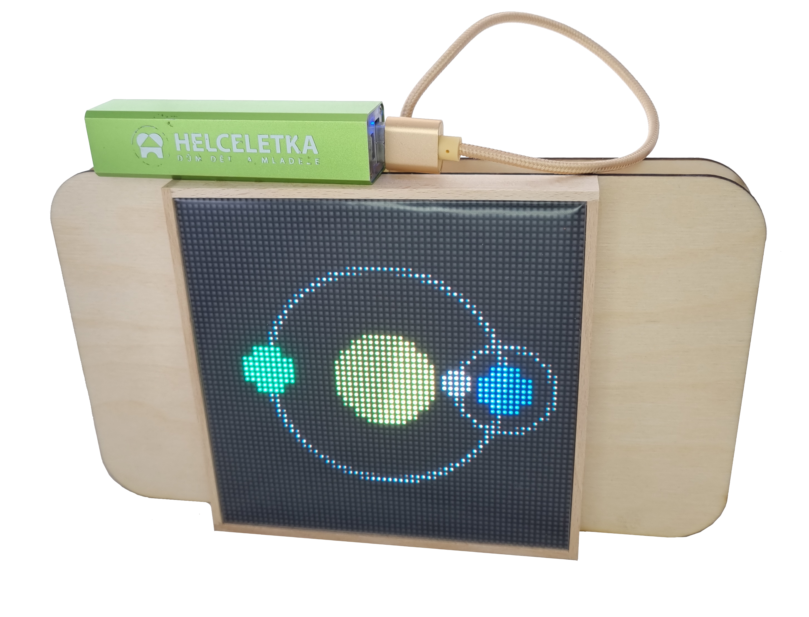

# Robotický tábor

Hlavním výrobkem letošního tábora je Robodeck.

něco o tom #TODO
 
 

#TODO něco tady napsat

[Lekce](https://2026.robotikabrno.cz/lekce){ .md-button  }

 

Programuje se stejně jako posledních pár let v TypeScriptu s pomocí Jacula ([jaculus.org](https://jaculus.org))

Ale tento rok máme nově **blokové** a **textové** programování ve webovém prostředí pomocí [**JacLy**](https://jacly.jaculus.org)

[JacLy](https://jacly.jaculus.org/){ .md-button }

 

Tento rok jsme také zvětšily možnosti pájení o [rozšiřující modulky](https://pmod.robotikabrno.cz) do pmod konektorů, které můžete přidat nejen na svůj Robodeck, ale také na Robůtka nebo elks.

 

Část pájecích výrobků si stále můžete vytvořit a k nim návody najdete zde.

[Pájecí výrobky](https://gadgets.robotikabrno.cz/){ .md-button .md-button--primary }

## Všechny odkazy co by se vám mohli hodit

- [2026.robotickytabor.cz](https://2026.robotickytabor.cz) - Tyto stránky se všemi návody co budete na táboře potřebovat
- [pmod.robotikabrno.cz](https://pmod.robotikabrno.cz) - Návody rozšiřujících modulů do PMOD konektorů
- [smd-challenge.robotikabrno.cz](https://smd-challenge.robotikabrno.cz/) - Návody pájecí challenge aka blikače v různých velikostech
- [gadgets.robotikabrno.cz](https://gadgets.robotikabrno.cz/) - Návody všech dalších pájecích hraček z minulých let 