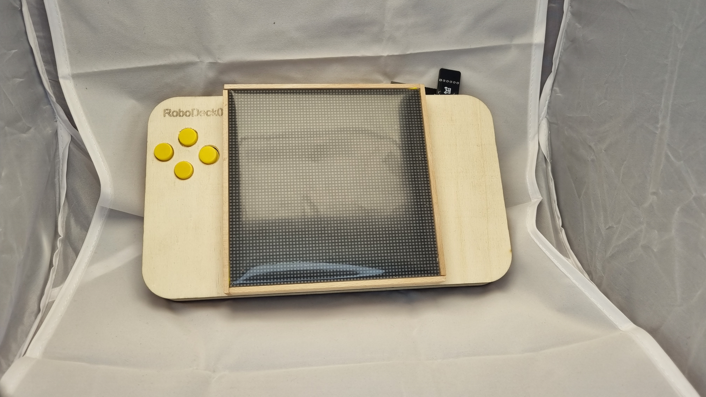

# Robotický tábor

Hlavním výrobkem letošního tábora je Robodeck.

Robodeck je modulární platforma sloužící k výuce základů programování a umožňující snadné vytváření a hraní jednoduchých her. Díky modularitě ji lze rozšiřovat o další moduly, které si můžete sami vyrobit a přidat na Robodeck. Všechny moduly jsou kompatibilní s Robůtkem a ELKS, takže je lze použít i u těchto zařízení.

Postup výroby Robodecku najdete v návodu "Robodeck".

[Robodeck](https://2026.robotikabrno.cz/robodeck){ .md-button }

Po úspěšném sestavení si můžete vyzkoušet programování a hraní her připravených v lekcích.

[Lekce](https://2026.robotikabrno.cz/lekce){ .md-button }

Po dokončení základních lekcí můžete Robodeck rozšiřovat o další moduly.

[Přídavné moduly](https://pmod.robotikabrno.cz/){ .md-button }

Pokud si nevíte rady, zkuste některou z připravených výzev. Jde o jednoduché projekty, které vám pomohou rozkoukat se a naučit se něco nového.

[Výzvy](https://challenge.robotikabrno.cz/){ .md-button }

Programujeme v TypeScriptu s pomocí Jaculus ([jaculus.org](https://jaculus.org)), stejně jako v předchozích letech. Letos nově nabízíme také **blokové** i **textové** programování ve webovém prostředí pomocí [**JacLy**](https://jacly.jaculus.org).

[JacLy](https://jacly.jaculus.org/){ .md-button .md-button--primary }

Některé pájecí výrobky si můžete stále vyrobit sami; návody najdete zde.

[Pájecí výrobky](https://gadgets.robotikabrno.cz/){ .md-button }

## Užitečné odkazy

- [2026.robotickytabor.cz](https://2026.robotickytabor.cz) - Stránky se všemi návody, které budete na táboře potřebovat
- [pmod.robotikabrno.cz](https://pmod.robotikabrno.cz) - Návody rozšiřujících modulů do PMOD konektorů
- [smd-challenge.robotikabrno.cz](https://smd-challenge.robotikabrno.cz/) - Návody pájecí challenge (blikající obvody) v různých velikostech
- [gadgets.robotikabrno.cz](https://gadgets.robotikabrno.cz) - Návody dalších pájecích hraček z minulých let