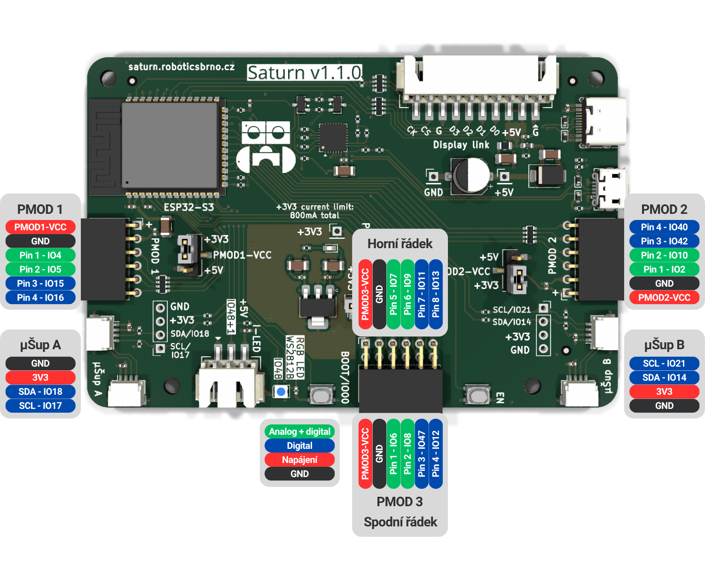

# Programování robodecku

## Programování:
Robodeck je řízený mikrokontrolérem ESP32-S3. K programování budeme používat jazyk TypeScript, který budeme spouštět pomocí programu [Jaculus](https://jaculus.org/).

Robodeck je samozřejmě možné programovat i v jiných jazycích, například C/C++ pod ESP-IDF, nebo Arduino. Pro tyto účely se dokumnetace stále dá použít jako zdroj informací, i když ne ukázek kódu.

[Lekce 0](lekce0/){ .md-button .md-button--primary }

## Přehled pinů

Všechny tyto piny jsou také v knihovně

