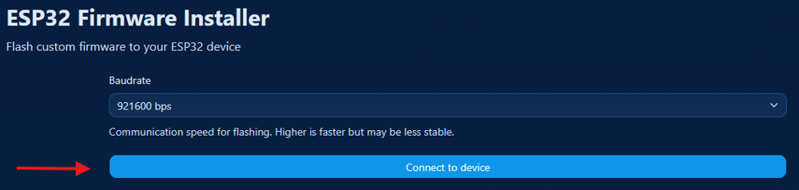
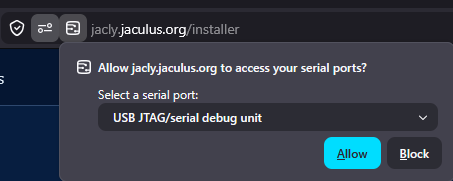
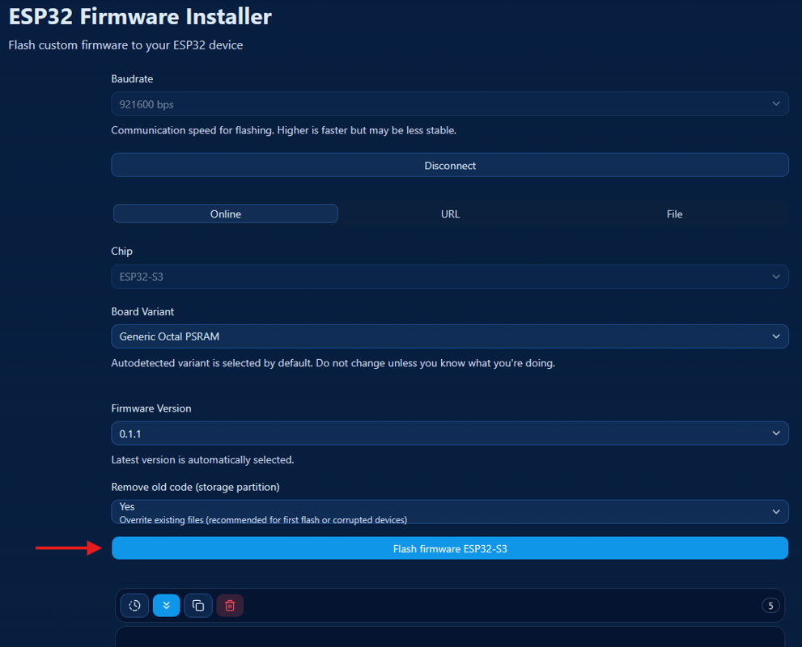
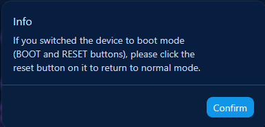
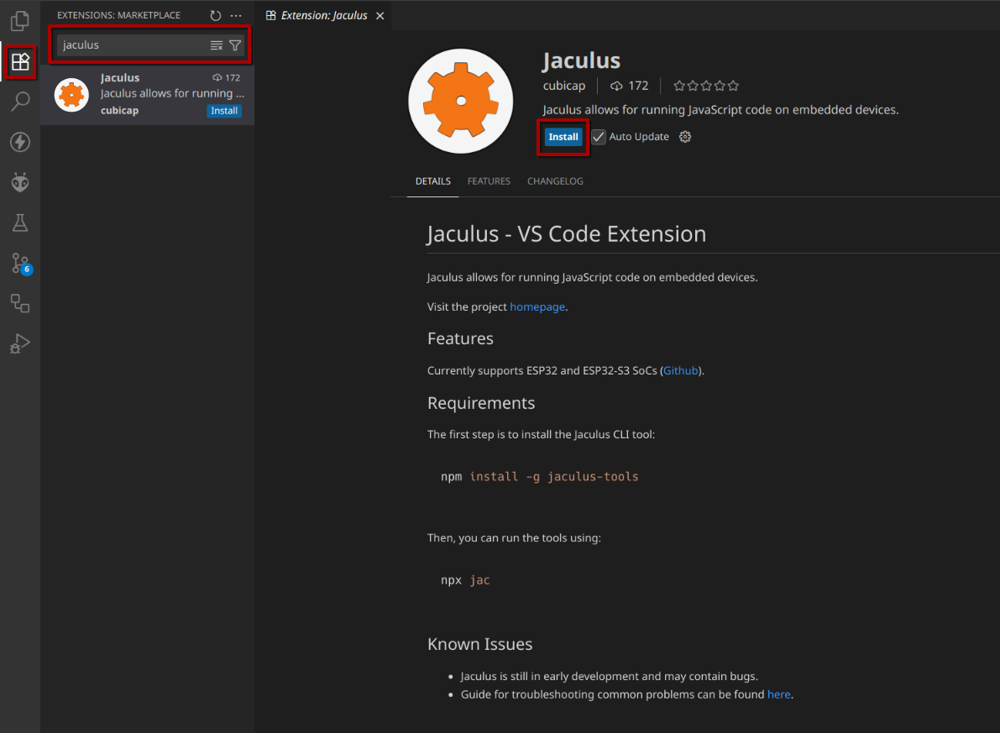
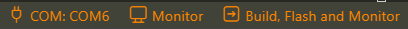
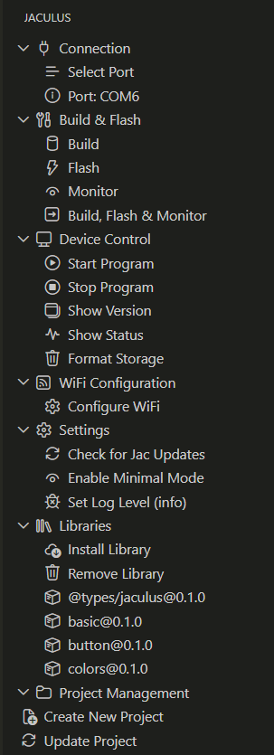

# Lekce 0 - Instalace prostředí

V této lekci si představíme Jaculus, nainstalujeme si programovací prostředí a spustíme první program.

## Instalace

Na našich deskách poběží Jaculus.
Tento program nám umožní jednoduše psát instrukce (programy), které nahrajeme do Robodecku.
Tyto programy budou specifikovat, jak se Robodeck má chovat a umožní nám s ním komunikovat.
Aby nám všechno správně fungovalo, musíme Jacula nejprve nainstalovat, a k němu i několik dalších programů.

<!-- TODO je toto potreba? - ano @C2Coder -->
!!! note "Na Linuxu je třeba přidat oprávnění udev, [více zde](https://docs.espressif.com/projects/esp-idf/en/v5.2.2/esp32s2/api-guides/dfu.html#udev-rule-linux-only)."

### Firmware

1. Připojíme Saturn k počítači přes `USB-C`

    !!! warning "Pokud by se Saturn sám odpojoval a připojoval, je potřeba ho přepnout do `boot režimu`. Stačí na desce držet tlačítko `BOOT` a zmáčknout tlačítko `EN`"

2. Otevřeme si [Jaculus web installer](https://jacly.jaculus.org/installer) v Chrome, Edge nebo novém Firefoxu.

    !!! warning "Instalace nebude fungovat v prohlížečích, které nepodporují rozhraní WebSerial."

3. Po přípojení klikneme na tlačítko `Connect to device` 

    

4. V nově otevřeném okně zvolíme port, na kterém je Saturn připojený a klikneme na `Connect`. Typicky to je port `COM`, `ttyACM`, `USB JTAG/serial debug unit`.

    !!! tip "Pokud nevíte, který port zvolit, zkuste odpojit Saturn a znovu připojit. Port, který se objeví, je ten správný."

    

5. Počkáme, až se installer načte. Poté klikneme na tlačítko `Flash firmware ESP32-S3`

    !!! danger "Neměňte žádná nastavení installeru."

    

6. Počkejte, než se firmware naflashuje. Jakmile se objeví dialog, stačí ho odkliknout.

    

7. Nakonec už jen stačí zmáčknout na desce tlačítko `EN` a máte hotovo.

!!! warning "Instalace programů" 

    Po stáhnutí programů (například Node.js a Visual Studio Code) je potřeba je i nainstalovat. K tomu slouží instalační soubor. Měl by se nacházet ve složce `Download`. Jméno souboru by mělo být podobné názvu programu.

### Node.js

Node.js je program, který nám umožní nahrávat kód do Jacula a komunikovat s ním.

1. Stáhneme si `Node.js` (nejnovější stabilní verzi - LTS) - [Stahuj ZDE pro Windows na táborové wifi](https://files.robotickytabor.cz/node.msi).
2. Nainstalujeme jej dle výchozího nastavení (není potřeba nic měnit).

### Visual Studio Code

Visual Studio Code je programovací prostředí, které nám umožní psát kód a s rozšířením nám dovolí nahrávat kód do zařízení.
1. Stáhneme si `Visual Studio Code` (nejnovější stabilní verzi)  - [Stahuj ZDE pro Windows na táborové wifi](https://files.robotickytabor.cz/vscode.exe). 
2. Nainstalujeme jej dle výchozího nastavení (není potřeba nic měnit).

### Jaculus

Nyní už se můžeme vrhnout na samotnou instalaci [Jaculus](https://jaculus.org/getting-started/).

1. Po instalaci `Node.js` **restartujeme** aplikaci Visual Studio Code.
2. V horním menu VSCode vybereme záložku `Terminal` a zvolíme `New Terminal`.
3. Do terminálu zadáme příkaz vypsaný níže. Na `Linuxu` bude nejspíše potřeba `sudo` práva.

    ```bash
    npm install -g jaculus-tools
    ```

    !!! tip "Dostávám chybu"
        Pro aplikování všech změn je nutný restart VSCode. Pokud se vám nedaří nainstalovat Jaculus, zkuste nejdříve restartovat VSCode.

4. Pro otestování instalace zadáme do terminálu příkaz:

    ```bash
    npx jac
    ```

    Program by měl vypsat nápovědu.

    ??? info "Ukázka nápovědy"
        ```
        Usage: jac <command>

        Tools for controlling devices running Jaculus

        Commands:
        help            Print help for given command                              
        version         Get version of device firmware                            
        list-ports      List available serial ports                               
        install         Install Jaculus to device                                 
        build           Build TypeScript project                                  
        flash           Flash code to device (replace contents of ./code)         
        lib-build       List libraries from project package.json                  
        lib-install     Install Jaculus libraries base on project's package.json  
        lib-list        List libraries from project package.json                  
        lib-remove      Remove a library from the project package.json            
        lib-search      Search libraries in configured registries                 
        pull            Download a file/directory from device                     
        ls              List files in a directory                                 
        read            Read a file from device                                   
        write           Write a file to device                                    
        rm              Delete a file on device                                   
        mkdir           Create a directory on device                              
        rmdir           Delete a directory on device                              
        upload          Upload a file/directory to device                         
        format          Format device storage                                     
        project-create  Create project from package                               
        project-update  Update existing project from package skeleton             
        resources-ls    List available resources                                  
        resources-read  Read a resource from device                               
        start           Start a program                                           
        stop            Stop a program                                            
        status          Get status of device                                      
        monitor         Monitor program output                                    
        wifi-get        Display current WiFi config                               
        wifi-ap         Set WiFi to AP mode (create a hotspot)                    
        wifi-add        Add a WiFi network                                        
        wifi-rm         Remove a WiFi network                                     
        wifi-sta        Set WiFi to Station mode (connect to a wifi)              
        wifi-disable    Disable WiFi                                              
        serial-socket   Tunnel a serial port over a TCP socket                    

        Global options:
        --log-level   Set log level (default: info)                  
        --help        Print this help message                        
        --port        Serial port to use (default: first available)  
        --baudrate    Baudrate to use (default: 921600)              
        --socket      host:port to use
        ```

### Jaculus VSCode rozšíření
<!-- TODO do later -->
Rozšíření pro VSCode nám umožní jednoduše nahrávat kód do Jacula pomocí ikonek a klávesových zkratek.

1. V levém menu VSCode vyberte záložku `Extensions` a vyhledejte `Jaculus`.
    
2. Zvolte `Install`.
3. Používání Jaculu

    - Po otevření projektu by se vám ve spodní liště měly objevit oranžové ikonky Jacula. 
    

    - V boční liště by se měla objevit záložka Jaculus, přes kterou můžete vytvořit projekt a následně spouštět Jaculus příkazy.

    


!!! tip "Něco ti nefunguje?"
    Podívej se na [Často kladené dotazy](../faq/index.md)