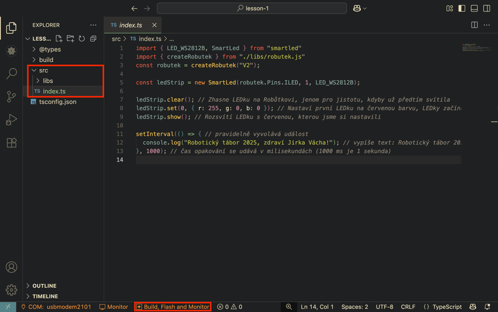

# Lekce 1 - První projekt

Zde si vyzkoušíme vytvořit první projekt a nahrát jej do Robůtka.

<!-- TODO will need to be changed in other lessons -->


=== "Bločky"
    Bločky jsou vizuální programovací jazyk, který je vhodný pro začátečníky. Program se skládá z jednotlivých bloků, které se skládají dohromady. Každý blok má svůj význam a program se vykonává postupně odshora dolů. 

    ## Vytvoření projektu
    1. Bločky budeme skládat v editoru [Jacly](https://jacly.jaculus.org/project). Ten si teď otevřeme v prohlížeči. 
    <!-- TODO Chrome based browser -->

    2. V pravém horním rohu si můžeme zvolit jazyk. 
    

    3. Kliknutím na tlačítko `Vytvořit nový projekt` si vytvoříme nás první projekt. 
    
    
    4. Po kliknutí na tlačítko si musíme projekt pojmenovat, vybrat typ a šablonu. Jméno si vybereme takové, abychom od sebe projekty lehce rozlišili. Typ projektu zvolíme `Jacly bloky projekt` a šablonu `template-jackly`. Pak už stačí kliknout na tlačítko `Vytvořit projekt`.
        
        <!-- TODO change template-jackly -->
        
        !!! warning "Pokročilá nastavení neměníme."

    ## Práce s prostředím
    V Jacly je spousta tlačítek a kategorií, pro nás je zatím důležitých jen několik. 
    
    Na levé straně máme výběr bločků. Prozatím nás zajímají kategorie `Základní` a `SmartLed`. 
    
    V pravém horním rohu vidíme tlačítko `Připojit`. Před nahráním programu se musíme k Saturnu připojit. Připojení probíhá stejně jako při flashování firmware v minulé lekci. 
    
    Na pravé straně si rozklikneme kateogrii Konzole, ve které uvidíme, co nám Saturn posílá.

    Uprostřed máme programovací plochu, kde budeme bločky skládat dohromady.
    
    <!-- TODO blocky  -->

    ## Náš první projekt
    1. Zkusíme si poskládat a nahrát do Saturnu náš první projekt. Prozatím si poskládáme bločky podle obrázku.
    

    2. Po poskládání bločků klikneme na tlačítko `Připojit` a vybereme port, na kterém je Robůtek připojený. Poté klikneme na tlačítko `Sestavit a nahrát`. Pokud jsme vše udělali správně, měla by se nám na Saturnu rozsvítit LEDka červeně a v konzoli by se nám mělo vypisovat `Ahojky svete`.
        
        !!! warning "Je důležité vybrat správný typ led, v našem případě `LED_WS2812B`."

    3. Jakmile nám funguje úvodní program, zkusíme si ho trochu upravit. Zkuste si změnit barvu LED, vypisovanou zprávu a dobu čekání mezi výpisy.
        
        !!! warning "Po každé změně je potřeba program znovu nahrát."

    ## Výsupní úkol V1
    Udělejte program který bude střídavě blikat LEDkou červeně a zeleně a do konzole vypisovat `Ahojky svete` a `Nazdar svete`.  


=== "VS Code rozšíření"
    <!-- TODO final project link-->
    <!-- TODO update extension -->
    <!-- TODO update link -->
    ```
    https://robutek.robotikabrno.cz/v2/robot/lekce1/example1.tar.gz
    ```
    !!! warning "Varování"
        Odkaz si zkopírujte než začnete tvořit projekt, když vyjedete z VSCode při vytváření projektu, vytváření projektu se vám zruší.

    1. V prvním kroku si na počítači nachystáme složku `RoboCamp-2026`, do které si budeme ukládat veškeré projekty.
    2. Klikneme pravým tlačítkem na ikonku `Visual Studio Code` a vybereme možnost `New window`.
    3. Dále v rozšíření Jaculus vybereme `Create Project`.
    4. Zvolíme umístění projektu do složky `RoboCamp-2025`.
    5. Zadáme název projektu, např. `prvniProjekt`, potvrdíme `Enter`.
    6. Vložíme odkaz na projekt, potvrdíme `Enter`.
    7. Otevře se nám vytvořený projekt.
    8. Připojíme Robůtka přes `USB-C`. Pokud `USB-C` nefunguje, použijeme `micro-USB`.
    9. V levém spodním rohu vybereme :material-power-plug:`Select COM port` pro výběr portu, na kterém je Robůtek připojený. Poté se nápis změní na vybraný port.

        ??? tip "Vidíme více portů"
            Pokud se nám v nabídce zobrazí více portů, odpojíme Robůtka a zjistíme, který port zmizel. Po připojení Robůtka tento port vybereme.

    10. Dále zvolíme :material-eye:`Monitor`, ten slouží pro komunikaci se zařízením.


    ## Nahrání programu

    Pokud nám funguje připojení na :material-eye:`Monitor` a běží nám komunikace se zařízením, můžeme do zařízení zkusit nahrát náš první program.

    1. Ve VSCode máme otevřený první projekt. V levém `Exploreru` (`Průzkumníku`) vybereme soubor ze  `src` -> `index.ts`. V něm vidíme náš první program.
    2. Poté zvolíme :material-arrow-right:`Build, Flash and Monitor` pro nahrání programu do zařízení.

        !!! danger "Pokud se program nenahraje za ~10 vteřin, zkuste zmáčknout tlačítko označené `EN` a program nahrát znovu."

        
        <!-- TODO: update 2 and 3 current library and jaculus implementations -->
    3. Měli bychom vidět výstup z programu.
        ```bash
        $ jac monitor --port COM7
        Connecting to serial at COM7 at 921600 bauds... Connected.

        Robotický tábor 2025, zdraví Jirka Vácha!
        Robotický tábor 2025, zdraví Jirka Vácha!
        ```
    4. Pro ukončení terminálu, do něj klikneme a stiskneme ++ctrl+c++.


    ## Úprava programu

    Pokud nám funguje nahrávání kódu, můžeme se na něj podívat a zkusit jej upravit.
    Ve zdrojovém kódu jsou komentáře (`// tohle je komentář`), které nám popisují, co který řádek dělá.

    1. Prostudujeme si zdrojový kód.
    2. Upravíme pozdrav na své jméno.

        ??? note "Řešení"
            ```ts
            ...
            console.log("Robotický tábor 2025, zdraví Franta Flinta!");  // tady jsem změnil své jméno
            ...
            ```

    3. Pokusíme se změnit rychlost vypisování.

        ??? note "Řešení"
            ```ts
            ...
            setInterval(() => { /* náš kód */ }, 500); // čas opakování se udává v milisekundách (1000 ms je 1 sekunda)
            ...
            ```

    4. Upravíme barvu.

        ??? note "Řešení"
            Barvu lze zadat ve formátu RGB - poměr červené, zelené a modré barvy
            ```ts
            ...
            ledStrip.set(0, colors.rgb(0, 255, 0)); // nastavíme barvu LED na Robůtkovi na zelenou
            ...
            ```
            Můžeme také využít předem definované barvy.
            ```ts
            import * as colors from "./libs/colors.js"; // musíme na začátku programu importovat knihovnu s barvami
            ledStrip.set(0, colors.blue); // nastavíme barvu na modrou
            ```
            Předem definované barvy:

            - `red`
            - `orange`
            - `yellow`
            - `green`
            - `light_blue`
            - `blue`
            - `purple`
            - `pink`
            - `white`
            - `off`
    
    ## Výstupní úkol V1
