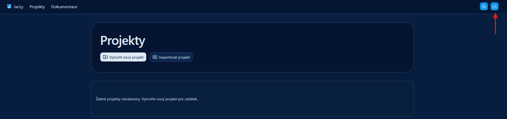
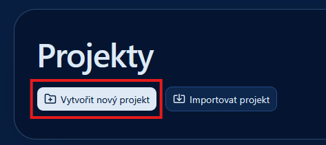
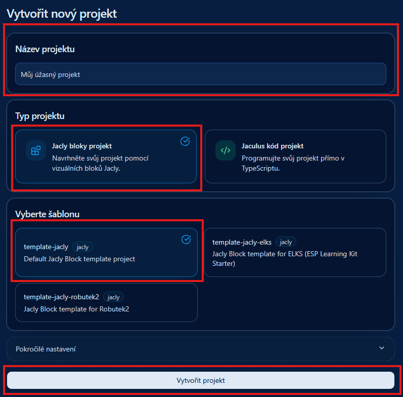
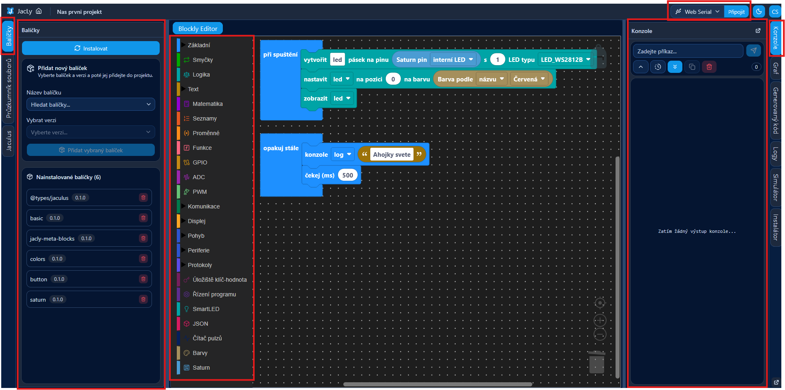
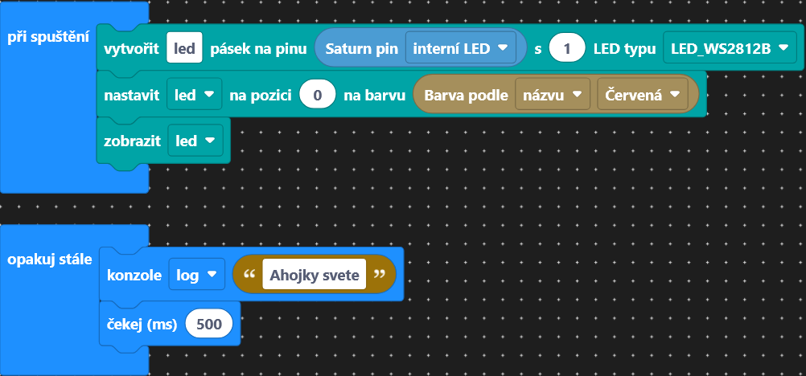
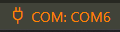
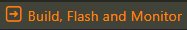

# Lekce 1 - První projekt

Zde si vyzkoušíme vytvořit první projekt a nahrát jej do Saturnu.

<!-- TODO will need to be changed in other lessons -->


=== "Bločky"
    Bločky jsou vizuální programovací jazyk, který je vhodný pro začátečníky. Program se skládá z jednotlivých bloků, které se skládají dohromady. Každý blok má svůj význam a program se vykonává postupně odshora dolů. 

    ## Vytvoření projektu
    1. Bločky budeme skládat v editoru [Jacly](https://jacly.jaculus.org/project). Ten si teď otevřeme v prohlížeči. 
    <!-- TODO Chrome based browser -->

    2. V pravém horním rohu si můžeme zvolit jazyk. 
    

    3. Kliknutím na tlačítko `Vytvořit nový projekt` si vytvoříme náš první projekt. 
    
    
    4. Po kliknutí na tlačítko si musíme projekt pojmenovat, vybrat typ a šablonu. Jméno si vybereme takové, abychom od sebe projekty lehce rozlišili. Typ projektu zvolíme `Jacly bloky projekt` a šablonu `template-jackly`. Pak už stačí kliknout na tlačítko `Vytvořit projekt`.
        
        <!-- TODO change template-jackly -->
        
        !!! warning "Pokročilá nastavení neměníme."

    ## Práce s prostředím
    V Jacly je spousta tlačítek a kategorií, pro nás je zatím důležitých jen několik. 
    
    Na levé straně máme výběr bločků. Prozatím nás zajímají kategorie `Základní` a `SmartLed`. 
    
    V pravém horním rohu vidíme tlačítko `Připojit`. Před nahráním programu se musíme k Saturnu připojit. Připojení probíhá stejně jako při flashování firmware v minulé lekci. 
    
    Na pravé straně si rozklikneme kategorii Konzole, ve které uvidíme, co nám Saturn posílá.

    Uprostřed máme programovací plochu, kde budeme bločky skládat dohromady.
    
    <!-- TODO blocky  -->

    ## Náš první projekt
    1. Zkusíme si poskládat a nahrát do Saturnu náš první projekt. Prozatím si poskládáme bločky podle obrázku.
    

    2. Po poskládání bločků klikneme na tlačítko `Připojit` a vybereme port, na kterém je Robodeck připojený. Poté klikneme na tlačítko `Sestavit a nahrát`. Pokud jsme vše udělali správně, měla by se nám na Saturnu rozsvítit LEDka červeně a v konzoli by se nám mělo vypisovat `Ahojky svete`.
        
        !!! warning "Je důležité vybrat správný typ led, v našem případě `LED_WS2812B`."

    ## Jak vlastně náš program funguje?
    Náš program se skládá ze dvou částí. 
    
    První část je blok `při spuštění`, který se vykoná jen jednou, když se program spustí. V něm inicializujeme LEDku, nastavíme ji na červenou a zobrazíme. 
    
    Druhá část je blok `opakuj stále`, který se vykonává stále dokola. V něm vypisujeme do konzole zprávu `Ahojky svete` a čekáme 500ms. 
    
    ## Zadání A
    Jakmile nám funguje úvodní program, zkusíme si ho trochu upravit. Zkusme si změnit barvu LED, vypisovanou zprávu a dobu čekání mezi výpisy. 
    !!! warning "Po každé změně je potřeba program znovu nahrát."

    ## Výstupní úkol V1
    Udělejte program který bude střídavě blikat LEDkou červeně a do konzole vypisovat `Nazdar svete`.  


=== "TypeScript"
    Nejprve si vytvoříme nový projekt a zkusíme ho nahrát, abychom otestovali, jestli vše funguje.
    === "Odkaz"
        Stačí kliknout na odkaz, otevře se nám VSCode a nabídne se nám možnost vytvořit projekt z připraveného balíčku.

        [Create project]( vscode://cubicap.jaculus/import?uri=https://2026.robotickytabor.cz/lekce/baseExample.tar.gz){.md-button .md-button--primary}
    === "VSCode extension"
        Otevřeme VSCode, v levém exploreru kliknema na extension `Jaculus` a tlačítko `Create Project`. Vybereme adresář, kde chceme mít projekt uložený a zadáme název projektu. Poté v menu vybereme možnost `Custom package URL` a zadáme toto URL: 
        
        `https://2026.robotickytabor.cz/lekce/baseExample.tar.gz`.
    === "Command line"
        Tento příkaz stačí zadat do terminálu v adresáři, kde chceme mít projekt uložený. Změníme `<PROJECT_NAME>` na název projektu, který chceme vytvořit.
        
        ```bash
        jac project-create --package https://2026.robotickytabor.cz/lekce/baseExample.tar.gz <PROJECT_NAME>
        ```
    === "Zip"
        Stáhneme si tento zip soubor, rozbalíme jej a otevřeme ve VSCode.
        
        [Zip soubor](https://2026.robotickytabor.cz/lekce/baseExample.zip){.md-button .md-button--primary}

    ## Nahrání programu
    <!-- TODO update for new extension -->
    Teď můžeme zkusit na Saturn nahrát náš první program. Vytvořili jsme si projekt, který obsahuje jednoduchý program, který nám bude vypisovat zprávu do konzole a rozsvítí LEDku na Saturnu. 

    1. Ve VSCode máme otevřený první projekt. V levém `Exploreru` (`Průzkumníku`) vybereme soubor ze  `src` -> `index.ts`. V něm vidíme náš první program.

    2. V levém dolním rohu klikneme na tlačítko `COM` a vybereme port, na kterém je Saturn připojený. Pro zjištění správného portu zkusíme Saturn odpojit a znovu připojit. V seznamu portů by se měl objevit nový port, který je právě Saturn. Ten si zapamatujeme a vybereme.
    

    3. Poté zvolíme :material-arrow-right:`Build, Flash and Monitor` pro nahrání programu do zařízení.
        

        !!! danger "Pokud se program nenahraje za ~10 vteřin, zkuste zmáčknout tlačítko označené `EN` a program nahrát znovu."


    4. Měli bychom vidět výstup z programu a zeleně svítící LEDku na Saturnu. 
        ```bash
        Ahojky svete
        Ahojky svete
        Ahojky svete
        Ahojky svete
        Ahojky svete
        Ahojky svete
        Ahojky svete
        Ahojky svete
        ```
    5. Pro ukončení terminálu, do něj klikneme a stiskneme ++ctrl+c++.

    ## Jak vlastně náš program funguje?
    Tato část importuje knihovny, které nám umožní ovládat LEDku a používat předem definované barvy a vytváří objekt LEDky, se kterým budeme pracovat. V našem případě je to LEDka na pinu 48, která je typu `LED_WS2812B`. Tato část teď není důležitá, takže ji necháme tak, jak je.
    ```ts
    import { SmartLed, LED_WS2812B } from "smartled";
    import * as colors from "colors";
    const led = new SmartLed(48, 1, LED_WS2812B);
    ```

    Tato část nastavuje LEDku na zelenou barvu a zobrazuje ji.
    ```ts
    led.set(0, colors.green);
    led.show();
    ```

    A nakonec tato část vypisuje do konzole zprávu `Ahojky svete` každých 1000ms.
    ```ts
    setInterval(() => {
        console.log("Ahojky svete");
    }, 1000);
    ```

    ## Úprava programu

    Pokud nám funguje nahrávání kódu, můžeme se na něj podívat a zkusit jej upravit.

    1. Prostudujeme si zdrojový kód.
    2. Upravíme pozdrav na své jméno.

        ??? note "Řešení"
            ```ts
            ...
            console.log("Ahojky svete, tady zdravi Frant Flinta z roku 2026");
            ...
            ```

    3. Pokusíme se změnit rychlost vypisování.

        ??? note "Řešení"
            ```ts
            ...
            setInterval(() => { /* náš kód */ }, 500); // čas opakování se udává v milisekundách (1000 ms je 1 sekunda)
            ...
            ```

    4. Upravíme barvu. Použijeme předdefinované barvy z knihovny `colors`.
    Předem definované barvy:
        - `red`
        - `orange`
        - `yellow`
        - `green`
        - `light_blue`
        - `blue`
        - `purple`
        - `pink`
        - `white`
        - `off`
        ??? note "Řešení"
            ```ts
            ...
            led.set(0, colors.blue); 
            ...
            ```
    
    ## Výstupní úkol V1
    Udělejte program který bude střídavě blikat LEDkou červeně a do konzole vypisovat Nazdar svete.