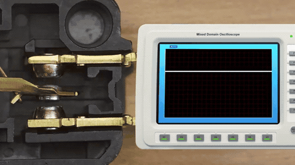

# Bonus Lekce 2.1 – Rozhraní GPIO a knihovna Button

!!! warning "Dobrovolná lekce" 

    Tato lekce je volitelná a slouží jako doplňující materiál pro ty, kteří chtějí hlouběji porozumět principům fungování digitálních vstupů a výstupů a obsluze mechanických tlačítek. Neobsahuje žádné povinné úkoly ani praktická cvičení.

### Co je to GPIO?

**GPIO (General Purpose Input/Output)** je univerzální rozhraní mikrokontroléru, které umožňuje konfigurovat jednotlivé piny pro příjem nebo odesílání digitálních signálů. GPIO se běžně využívá k řízení periferních zařízení a ke čtení dat z nich (například u PMOD modulů). 

Přestože rozhraní GPIO využívají i běžná tlačítka, jejich přímá obsluha přináší specifická úskalí spojená s mechanickými vlastnostmi spínačů. Tyto komplikace za nás na softwarové úrovni řeší knihovna `button`. U většiny ostatních periferních zařízení se však s těmito problémy (označovanými jako *bounce* a *debounce*) setkat nemusíme.

Přímé použití knihovny `gpio` představuje nízkoúrovňový (*low-level*) způsob, jak získávat data z tlačítek.

#### Příklad použití s vestavěným tlačítkem BOOT na desce Saturn (`SaturnPins.BootBtn`):

```ts
import * as gpio from "gpio";
import { SaturnPins } from "saturn";

// Nastavení pinu jako vstupního
gpio.pinMode(SaturnPins.BootBtn, gpio.PinMode.INPUT);

// Událost vyvolaná při sestupné hraně signálu (stisknutí tlačítka)
gpio.on("falling", SaturnPins.BootBtn, () => { 
    console.log("falling");
});

// Událost vyvolaná při vzestupné hraně signálu (uvolnění tlačítka)
gpio.on("rising", SaturnPins.BootBtn, () => { 
    console.log("rising");
});

// Pravidelné čtení a výpis digitální hodnoty pinu (0 nebo 1) každých 100 ms
setInterval(() => {
    console.log(gpio.read(SaturnPins.BootBtn)); 
}, 100);
```

Z kódu je patrné, že práce s knihovnou `gpio` je velmi podobná práci s knihovnou `button`. Knihovna `button` je totiž na rozhraní GPIO přímo postavena, doplňuje však další mechanismy, které usnadňují obsluhu tlačítek v reálných podmínkách. 

Proč je tato vrstva navíc potřebná, si můžeme demonstrovat, pokud máte k dispozici modul DPad.

---

### Tlačítka, bounce a debounce

Vyzkoušejme si stejný příklad, ale tentokrát s tlačítkem na externím modulu DPad. V kódu změňte pin `SaturnPins.BootBtn` na pin, ke kterému je připojen DPad (například `SaturnPins.Pmod1.Pin1`).

Při stisku tlačítka si v konzoli pravděpodobně všimnete, že se výpisy „falling“ a „rising“ objeví pro jedno stisknutí hned několikrát. Tento nežádoucí jev se nazývá **zákmit (bounce)**.

#### Proč k zákmitům dochází?
Zákmit je způsoben fyzikální konstrukcí mechanického tlačítka. To uvnitř obsahuje kovové kontakty, které se při stisku vlivem pružnosti materiálu od sebe několikrát mikroskopicky odrazí, než se pevně spojí. Během tohoto velmi krátkého okamžiku (v řádu milisekund) se elektrický obvod opakovaně rozpojí a spojí, což mikrokontrolér zaznamená jako sérii rychlých stisknutí a uvolnění.



Náchylnost k zákmitům se liší podle konstrukce a opotřebení tlačítka:

- **Vestavěné tlačítko BOOT** na desce Saturn má konstrukci, která zákmity minimalizuje. V konzoli proto obvykle uvidíte pouze jednu čistou událost „falling“ a „rising“.

- **Tlačítka na modulu DPad** jsou k zákmitům náchylnější a bez dodatečného ošetření se neobejdou.

#### Jak pomáhá knihovna `button`?
Knihovna `button` v sobě má implementované softwarové ošetření zákmitů, takzvaný **debounce** (odrušení). Ten krátké a rychlé změny stavu způsobené odrazy kontaktů odfiltruje a aplikaci předá až stabilní stav. Navíc nabízí podporu pro pokročilejší události, jako je kliknutí (`click`) nebo dvojklik (`doubleClick`). Z toho důvodu je pro běžný vývoj pohodlnější a bezpečnější používat knihovnu `button` namísto přímého přístupu přes rozhraní `gpio`.
