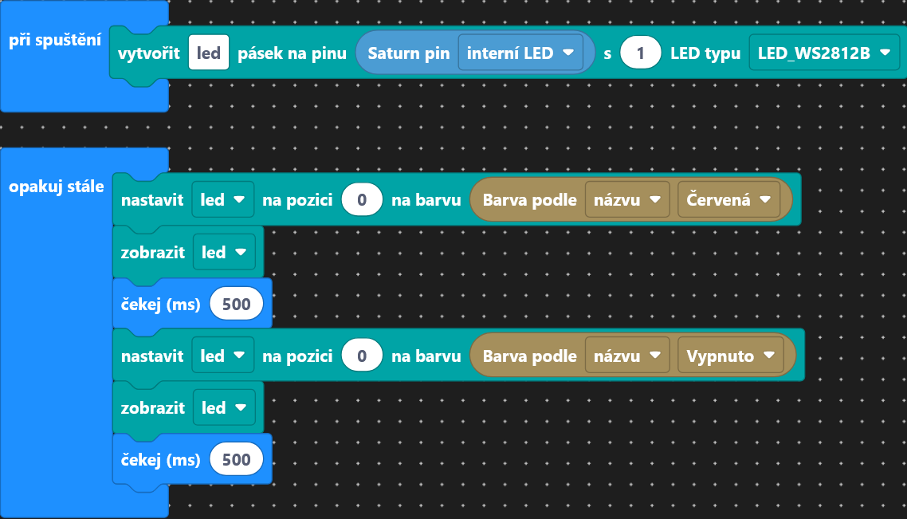
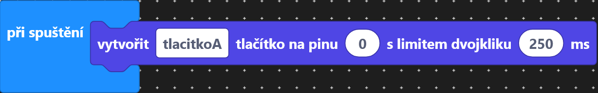
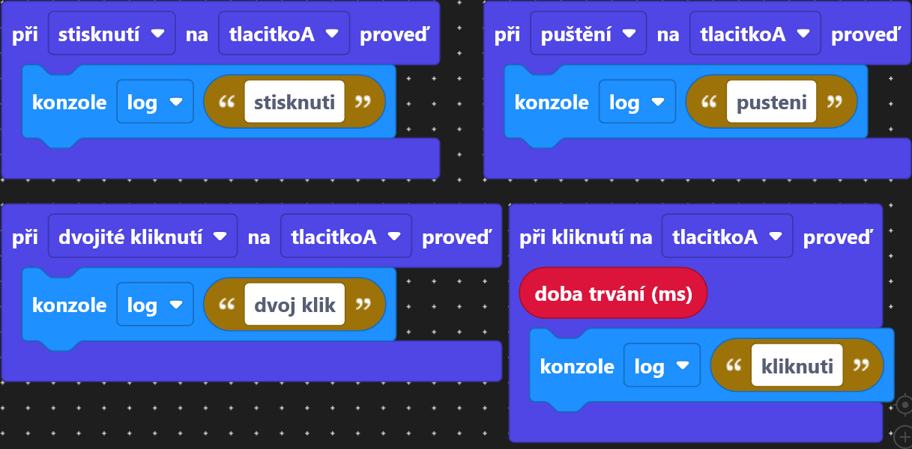
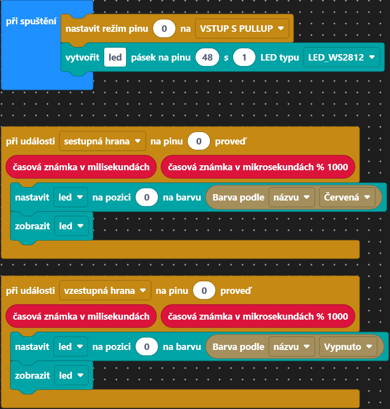
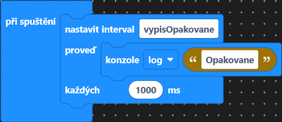
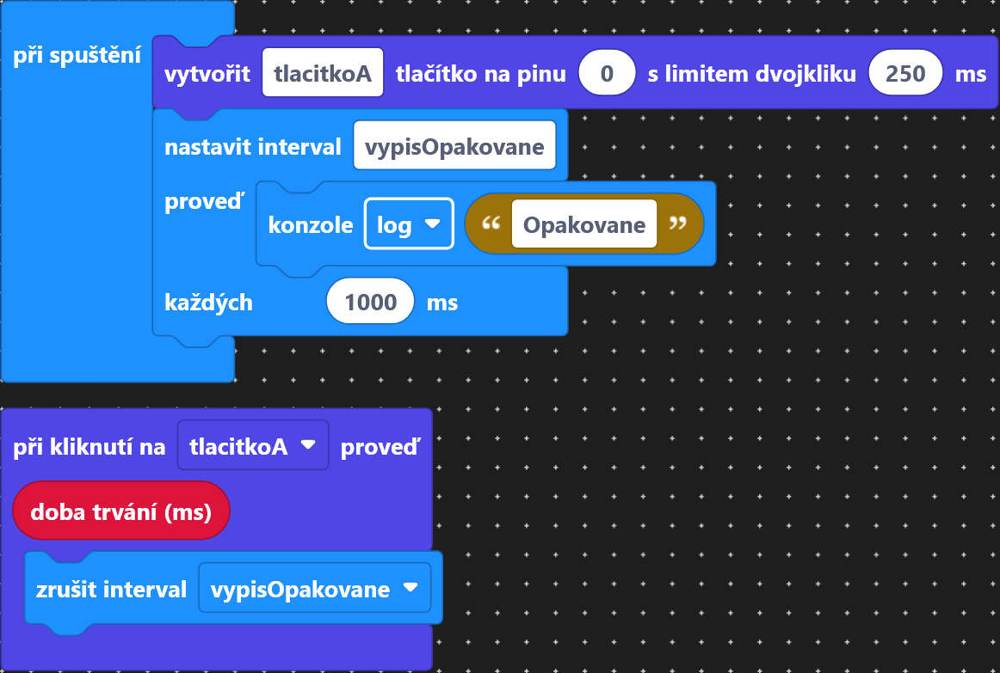
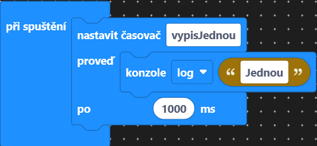
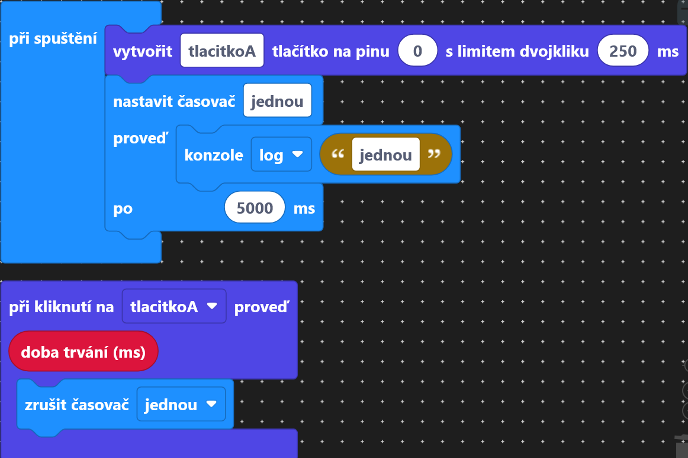
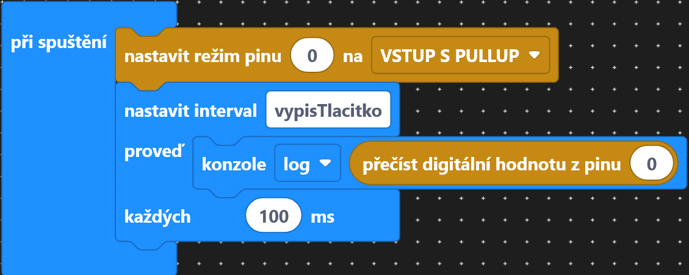

# Lekce 2 - RGB LED + tlačítko + události

V této lekci začneme se zajímavějšími programy.

Ukážeme si ovládání RGB LED umístěné na ESP32 a práci s událostmi řízenými tlačítkem nebo časem.

!!! note "Poznámka"
    V lekci 1 jsme se naučili, jak vytvořit nový projekt. Pokud nevíte, jak na to, podívejte se do lekce 1.

=== "Bločky"
    ## Zadání A
    Nejprve si ověříme znalosti z minulé lekce. Zkusíme blikat RGB LED na Saturnu (pin 48). Na začátku tohoto úkolu si otevřeme nový prázdný projekt. Můžete se inspirovat projektem z minulé lekce.

    ??? tip "Řešení"
        

    ## Co je to událost v programování?
    Událost je situace, kterou program rozpozná (například stisknutí nebo puštění tlačítka, uplynutí určitého času). Po zaznamenání události se vykoná kód, který je k této události přiřazen. Událostí může být například stisknutí tlačítka nebo uplynutí určitého času. 

    <!--TODO change all GPIO to buttons   -->
    ### Tlačítko
    Události řízené stiskem tlačítka můžeme ovládat pomocí bločků z podkategorie `Tlačítko` z kategorie `Periferie`.

    Tlačítko si nejprve musíme vytvořit bločkem `vytvořit tlačítko`. Políčko `limit dvojkliku` určuje, jak blízko musí být dvě kliknutí k sobě, aby byly považovány za dvojklik. 
    

    Na událost na tlačítku pak můžeme navázat blok kódu pomocí bloků `při kliknutí` a `při stisknutí/puštění/dvojití kliknutí`. Událost kliknutí nastane při stisknutí i puštění tlačítka, událost stisknutí při stisknutí tlačítka, událost puštění při puštění tlačítka a událost dvojitého kliknutí při dvojím kliknutí na tlačítko v daném časovém limitu. Bloček `při kliknutí` nám navíc dáva informaci o délce stisknutí.
    

    ## Zadání B
    <!-- TODO change pins to use lib -->
    Pomocí událostí rozsvítíme při stisknutí tlačítka LEDku na Saturnu a při puštění ji zhasneme. Tlačítko je na pinu `0`, LEDka na pinu `48`. Je důležité nezapomenout nastavit na začátku tlačítko a LEDku jako v předchozích úkolech.

    ??? tip "Řešení"
        

    ### Časové události
    Události řízene časem můžeme ovládat pomocí bločků z kategorie `Základní`. Jsou zde 2 typy událostí: `Intervaly` a `Časovače`. 

    #### Interval    
    Událost `Intervaly` nám umožní opakovaně spouštět kód každých `X` milisekund. Tento kód bude každou vteřinu vypisovat zprávu do konzole. Všimněme si, že čas se udává v milisekundách, takže 1000 ms je 1 sekunda.
    

    Interval běží, dokud ho neukončíme pomocí bloku `zrušit interval`.
    

    #### Časovač
    Událost `Časovač` nám umožní spustit kód po uplynutí určitého času.
    

    Časovač běží jen jednou, po uplynutí zadaného času. Pokud chceme časovač zastavit, můžeme použít blok `zrušit časovač`.
    

    ## Zadání C
    <!-- TODO update to use isPressed from Button lib -->
    Desetkrát za sekundu vypíšeme stav zmáčknutí tlačítka (0 nebo 1). Stav daného tlačítka získáme pomocí bloku `přečti digitální hodnotu z pinu` z kategorie `GPIO`. Opakování dosáhneme pomocí `Intervalů`, a informaci vypíšeme pomocí bloku `konzole`. Všimněme si, že blok na čtení digitální hodnoty má narozdíl od ostatních bloků kulatý tvar, tedy se dá vložit do kulatých míst v jiných blocích. Můžeme ho tedy vložit do bloku `konzole`. Pokud je tlačítko stisknuté, blok pro čtení nám dá `0`, pokud stisknuté není, dá nám `1`.

    ??? tip "Řešení"
        

    ## Výstupní úkol V1 - Pozdrav
    Při stisknutí tlačítka vypíšeme pozdrav.

    ## Výstupní úkol V2 - Změna barvy
    Při stisknutí tlačítka rozsvítíme LED na Saturnu jednou barvou a při puštění barvu změníme na jinou.


=== "TypeScript"
    <!-- TODO update to use PINS library -->
    ## Zadání A

    Nejprve si ověříme znalosti z minulé lekce. Zkusíme blikat RGB LED na Saturnu (pin 48). Na začátku tohoto úkolu si otevřeme nový prázdný projekt. Můžete se inspirovat projektem z minulé lekce.

    ??? tip "Řešení"

        ```ts
        import * as basic from "basic";
        import { SmartLed, LED_WS2812B } from "smartled";
        import * as colors from "colors";

        const led = new SmartLed(48, 1, LED_WS2812B);

        basic.forever(async () => {
            led.set(0, colors.red);
            led.show();
            await sleep(250);
            led.set(0, colors.off);
            led.show();
            await sleep(250);
        });
        ```

    ## Co je to událost v programování?
    Událost je situace, kterou program rozpozná (například stisknutí nebo puštění tlačítka, uplynutí určitého času). Po zaznamenání události se vykoná kód, který je k této události přiřazen. Událostí může být například stisknutí tlačítka nebo uplynutí určitého času. 

    ### Tlačítko
    Události řízené stiskem tlačítka můžeme ovládat příkazů ze knihovny `gpio`.
    ```ts
    import * as gpio from "gpio";
    ```
    Abychom mohli přijímat signál ze stisknutí tlačítka, musíme nastavit vybraný pin jako vstupní pomocí příkazu `gpio.pinMode(PIN, MODE)`, kde `PIN` je číslo pinu, a `MODE` je režim. My chceme využít pin `0` a nastavit ho na `INPUT_PULLUP`.
    ```ts
    gpio.pinMode(0, gpio.PinMode.INPUT_PULLUP);
    ```

    Poté si můžeme připojit k dané události blok kódu pomocí příkazu gpio.on(EVENT, PIN, () => {...}). Argument `EVENT` může být hodnota `"falling"`, `"rising"` nebo `"change"`. Událost `"falling"` nastane při stisknutí tlačítka, `"rising"` při puštění tlačítka a `"change"` při stisknutí i puštění tlačítka. Argument `PIN` je číslo pinu a `() => {...}` je kód, který se vykoná při dané události.
    ```ts
    gpio.on("falling", 0, () => {
        console.log("Button pressed");
    });

    gpio.on("rising", 0, () => {
        console.log("Button released");
    });

    gpio.on("change", 0, () => {
        console.log("Button value changed");
    });
    ```

    Když vše spojíme dohromady, můžeme při stisknutí tlačítka vypsat zprávu do konzole.
    ```ts
    import * as gpio from "gpio";

    gpio.pinMode(0, gpio.PinMode.INPUT_PULLUP);

    gpio.on("falling", 0, () => {
        console.log("Button pressed");
    });

    gpio.on("rising", 0, () => {
        console.log("Button released");
    });

    gpio.on("change", 0, () => {
        console.log("Button value changed");
    });
    ```

    ## Zadání B
    Pomocí událostí rozsvítíme při stisknutí tlačítka LEDku na Saturnu a při puštění ji zhasneme. Tlačítko je na pinu `0`, LEDka na pinu `48`. Je důležité nezapomenout nastavit na začátku tlačítko a LEDku jako v předchozích úkolech.

    ??? tip "Řešení"
        

    ### Časové události
    Události řízene časem můžeme ovládat pomocí bločků z kategorie `Základní`. Jsou zde 2 typy událostí: `Intervaly` a `Časovače`. 
    
    Událost `Intervaly` nám umožní opakovaně spouštět kód každých `X` milisekund. Tento kód bude každou vteřinu vypisovat zprávu do konzole. Všimněme si, že čas se udává v milisekundách, takže 1000 ms je 1 sekunda.
    

    Interval běží, dokud ho neukončíme pomocí bloku `zrušit interval`.
    

    Událost `Časovače` nám umožní spustit kód po uplynutí určitého času.
    

    Časovač běží jen jednou, po uplynutí zadaného času. Pokud chceme časovač zastavit, můžeme použít blok `zrušit časovač`.
    

    <!-- TODO Udalost v programovani -->
    <!-- TODO GPIO -->
    <!-- TODO Zadani B -->
    <!-- TODO Zadani C -->
    <!-- TODO Vystup V1 -->
    <!-- TODO Vystup V2 -->
    typescript
    <!-- TODO addd new project  -->


    ## Co je to událost v programování?

    Událost je situace, kterou program rozpozná (například stisknutí nebo puštění tlačítka, uplynutí určitého času). Po zaznamenání události se vykoná kód, který je k této události přiřazen. Událostí může být například stisknutí tlačítka nebo uplynutí určitého času. 

    Tla4

    S událostí řízenou časem už jsme se setkali: pomocí `setInterval` umíme každých `X` milisekund spouštět daný kód. Zatim ale nevíme, jak `setInterval` ukončit, tedy jak přestat kód opakovaně spouštět. K tomu slouží funkce `clearInterval(INTERVAL_ID)`. `INTERVAL_ID` nám při vytáření intervalu vrátí funkce `setInterval()`.

    ```ts
    import { createRobutek } from "./libs/robutek";
    const intervalId = setInterval(()=>{
        console.log("interval");
    }, 1000);

    await sleep(10000);

    clearInterval(intervalId);
    ```


    Události řízené stiskem tlačítka můžeme ovládat pomocí přiložené knihovny `gpio`.
    `GPIO` je jednoduchá elektronická konstrukce, která nám umožňuje posílat nebo přijímat bitové informace, a na základě toho měnit chování našeho programu.

    Abychom mohli přijímat signál ze stisknutí tlačítka, nejdříve musíme nastavit vybraný pin jako vstupní. To uděláme příkazem `#!ts gpio.pinMode(PIN, gpio.PinMode.INPUT)`, kde `PIN` je číslo pinu (najdeme pod `robutek.Pins.`), a druhý argument je režim. Pokud bychom chtěli např. použít LEDky přímo na desce, chceme dané piny použít jako výstupní, tedy `gpio.PinMode.OUTPUT`.

    Jakmile máme nastavené vstupní tlačítko, můžeme na něm pozorovat události pomocí `#!ts gpio.on()`. Reakci na stisknutí tlačítka vyvoláme argumentem `"falling"`, reakci na puštění `"rising"`. Kód, který při stisku tlačítka něco vykoná, tedy může vypadat takto:

    ```ts
    gpio.pinMode(robutek.Pins.ButtonRight, gpio.PinMode.INPUT);

    gpio.on("falling", robutek.Pins.ButtonRight, () => {
    // něco udělej
    });
    ```

    ## Zadání B

    Pomocí událostí rozsvítíme při stisknutí tlačítka (`robutek.Pins.ButtonRight`) RGB LED na ESP32 (`robutek.Pins.ILED`) a při puštění ho opět zhasneme.

    ??? note "Řešení"

        ```ts
        import { createRobutek } from "./libs/robutek.js"
        import * as colors from "./libs/colors.js";
        import { LED_WS2812B, SmartLed } from "smartled";
        import * as gpio from "gpio";

        const robutek = createRobutek("V2");

        const ledStrip = new SmartLed(robutek.Pins.ILED, 1, LED_WS2812B);

        gpio.pinMode(robutek.Pins.ButtonRight, gpio.PinMode.INPUT); // nastaví pin 0 jako vstup

        gpio.on("falling", robutek.Pins.ButtonRight, () => { // událost, která proběhne při stisknutí tlačítka připojeného na pin 0
            ledStrip.set(0, colors.red); // nastaví barvu první LED na červenou
            ledStrip.show(); // zobrazí nastavení na LED
        });

        gpio.on("rising", robutek.Pins.ButtonRight, () => { // událost, která proběhne při puštění tlačítka připojeného na pin 0
            ledStrip.set(0, colors.off); // nastaví první LED na zhasnutou
            ledStrip.show(); // zobrazí nastavení na LED
        });
        ```

    ## Zadání C

    Dvakrát za sekundu vypíšeme stav zmáčknutí tlačítka (0 nebo 1). Stav daného tlačítka získáme pomocí `#!ts gpio.read(číslo pinu)`.

    Vzpomeňme si z prvního programu, že opakování dosáhneme pomocí `setInterval()`, a informaci vypíšeme pomocí `#!ts console.log()`.

    ??? note "Řešení"

        ```ts
        import * as gpio from "gpio";
        import { createRobutek } from "./libs/robutek.js";
        const robutek = createRobutek("V2");

        gpio.pinMode(robutek.Pins.ButtonRight, gpio.PinMode.INPUT); // nastaví pin 0 jako vstup

        setInterval(() => { // pravidelně vyvolává událost
            console.log(gpio.read(robutek.Pins.ButtonRight)); // načte a vypíše stav tlačítka připojeného na pin 0
        }, 500); // čas opakování se udává v milisekundách (500 ms je 0,5 sekundy)
        ```

    ## Výstupní úkol V1 - Pozdrav

    Při stisknutí tlačítka (`robutek.Pins.ButtonRight`) vypíšeme pozdrav.

    ## Výstupní úkol V2 - Změna barvy

    Při stisknutí tlačítka (`robutek.Pins.ButtonRight`) rozsvítíme RGB LED na Robůtkovi (`robutek.Pins.ILED`) jednou barvou a při puštění barvu změníme na jinou.
