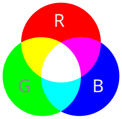
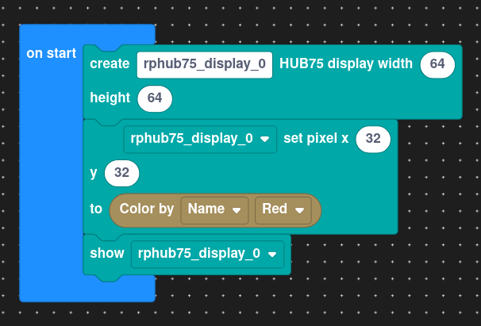
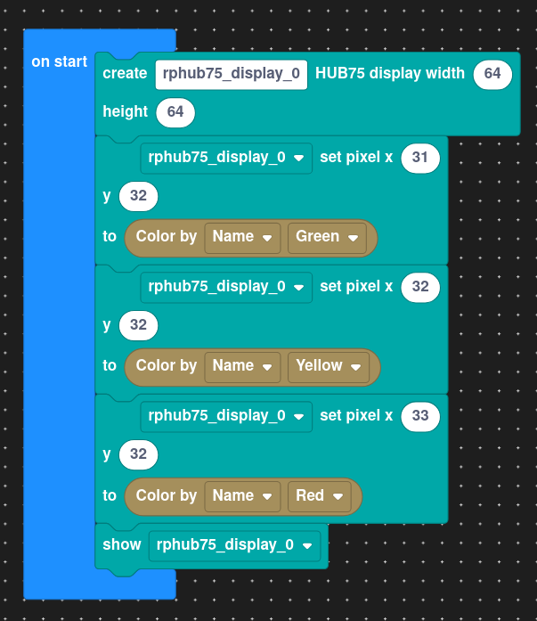
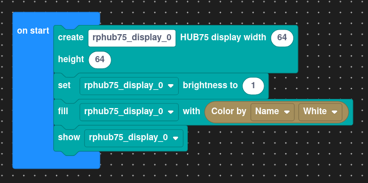
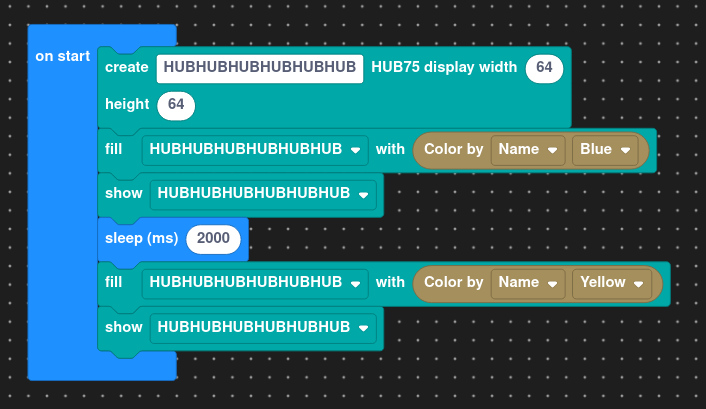

# Lekce 3 - Displej

Saturn má k dispozici 64x64 barevný displej, který se v této lekci naučíme ovládat.

## Příprava projektu

K práci s displejem si stáhneme příslušné knihovny pomocí následujících příkazů:
```bash
jac lib-install rphub75
jac lib-install colors
```

## Barvičky

Barevné světlo vytváříme ze tří základních barev: červená (RED), zelená (GREEN), a modrá (BLUE).
Tyto barvy pomocí funkce `colors.rgb` mícháme v různých poměrech od 0 do 255, a vytváříme tak různé barvy:

- První hodnota (r) nám dává množství červené
- Druhá (g) dává množství zelené
- Třetí (b) dává množství modré



Zde je pár praktických příkladů:

 - lososová: `#!ts colors.rgb(245, 125, 165)`
 - obsidianová: `#!ts colors.rgb(42, 31, 59)`
 - mátozubňopastová: `#!ts colors.rgb(185, 250, 217)`

Pokud tyto nestačí, knihovna `colors` obsahuje také předdefinovanou kolekci vzácnějších barev, jako jsou `#!ts colors.red`, `#!ts colors.yellow`, `#!ts colors.white`, ...

## Jednoduché kreslení

Začneme kreslením jediné tečky. Nejdříve naimportujeme potřebné knihovny, připravíme displej,
nastavíme barvu pixelu a potvrdíme změny. Příklad:

=== "TypeScript"
    ```ts
    import { Display } from "rphub75";
    import * as colors from "colors";

    // Tento řádek připraví displej ke kreslení.
    const display = new Display();

    // Tento řádek nastaví barvu jediného pixelu.
    // První číslo udává x-ovou souřadnici a druhé y-ovou.
    // Jelikož má displej velikost 64x64, tento pixel je jeden ze středových.
    display.setPixel(32, 32, colors.red);

    // Tento řádek propíše provedené změny do displeje.
    display.show();
    ```
=== "Bločky"
    

!!! warning "Upozornění"
    Dokud není zavolána funkce `show`, změny se nepropíšou!

## Zadání A

Nakresli semafor: zelenou, žlutou a červenou tečku vedle sebe.

??? note "Řešení"
    === "TypeScript"
        ```ts
        import { Display } from "rphub75";
        import * as colors from "colors";

        const display = new Display();
        display.setPixel(31, 32, colors.green);
        display.setPixel(32, 32, colors.yellow);
        display.setPixel(33, 32, colors.red);
        display.show();
        ```

    === "Bločky"
        

## Výplň

Pomocí funkce `#!ts Display.fill` lze jednoduše vyplnit celý displej jednolitou barvou. Hlavním využitím je následující kód který rozsvítí veškeré LEDky na maximum a zajistí tak odvaření displeje.
=== "TypeScript"
    ```ts
    import { Display } from "rphub75";
    import { white } from "colors";

    const display = new Display();
    display.brightness = 1;
    display.fill(white);
    display.show();
    ```
=== "Bločky"
    

## Zadání B

Vyplň celý displej modrou barvou a pak po dvou vteřinách žlutou.

??? tip "Nápověda"
    Čekání se dělá pomocí následujícího příkazu: `#!ts await sleep(pocetMilisekund);`

    ??? tip "Nápověda 2"
        Jedna sekunda má tisíc milisekund.

        ??? tip "Nápověda 3"
            Dva krát tisíc jsou dva tisíce.

            ??? tip "Nápověda 4"
                <math style="font-size: 1.5em;" xmlns="http://www.w3.org/1998/Math/MathML">
                  <mrow>
                    <mn>2</mn>
                    <mi>a</mi>
                    <mo>=</mo>
                    <mi>a</mi>
                    <mo>+</mo>
                    <mi>a</mi>
                  </mrow>
                </math>

                ??? tip "Nápověda 5"
                    <math style="font-size: 1.5em;" xmlns="http://www.w3.org/1998/Math/MathML" display="block">
                      <mrow>
                        <mrow>
                          <munderover>
                            <mo>&#x2211;</mo>
                            <mrow><mi>n</mi><mo>=</mo><mn>1</mn></mrow>
                            <mi>&#x221E;</mi>
                          </munderover>
                          <mfrac>
                            <mn>1</mn>
                            <msup><mi>n</mi><mi>s</mi></msup>
                          </mfrac>
                          <mo>=</mo>
                          <mn>0</mn>
                        </mrow>
                        <mspace width="0.5em"/>
                        <mo>&#x27F9;</mo>
                        <mspace width="0.5em"/>
                        <mrow>
                          <mi>Re</mi>
                          <mo>&#x2061;</mo>
                          <mo>(</mo>
                          <mi>s</mi>
                          <mo>)</mo>
                          <mo>=</mo>
                          <mfrac><mn>1</mn><mn>2</mn></mfrac>
                        </mrow>
                      </mrow>
                    </math>

                    ??? tip "Nápověda 6"
                        <iframe src="https://nickarocho.github.io/minesweeper/" title="Minesweeper" width="600" height="800"></iframe>

??? note "Řešení"
    === "TypeScript"
        ```ts
        import { Display } from "rphub75";
        import * as colors from "colors";

        const display = new Display();

        display.fill(colors.blue);
        display.show();

        await sleep(2000);

        display.fill(colors.yellow);
        display.show();
        ```

    === "Bločky"
        

## Výstupní úkol

Nakresli smajlík :-) Ćím hezčí, tím víc bodů*

??? abstract "Poznámka"
    \* Body mají čistě symbolickou hodnotu. Organizátoři neručí za férovost jejich udělování.

    \** Mračící smajlíky jsou protizákonné. Mezi možné tresty patří odnětí večeře.
