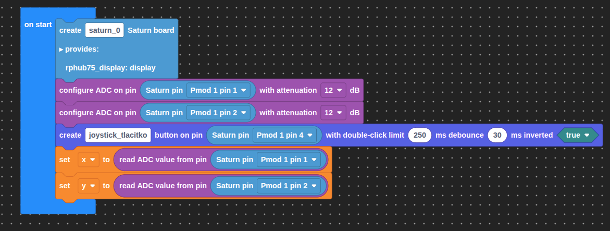
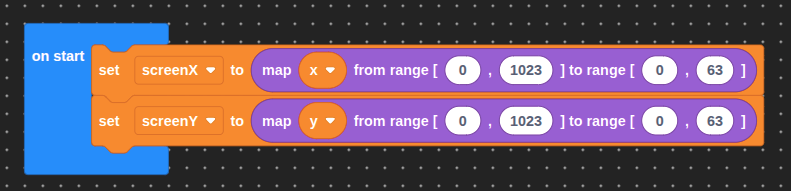
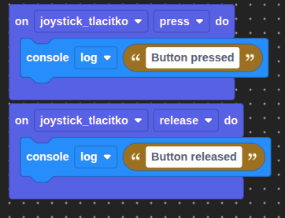
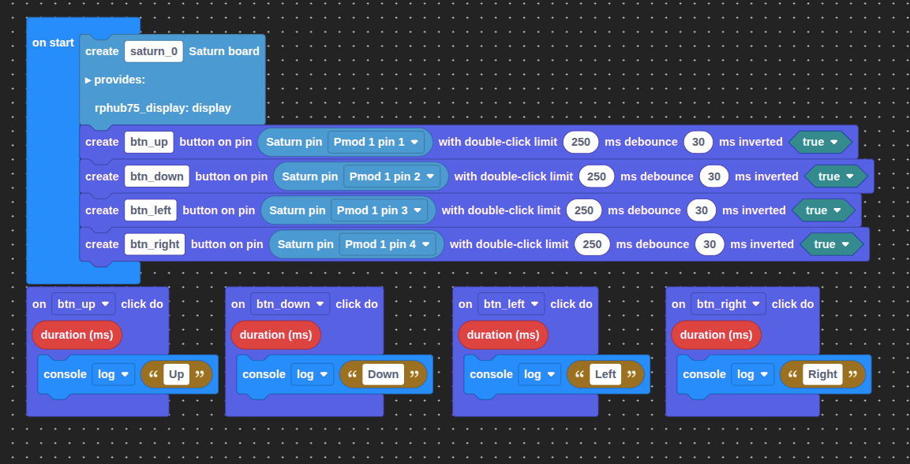
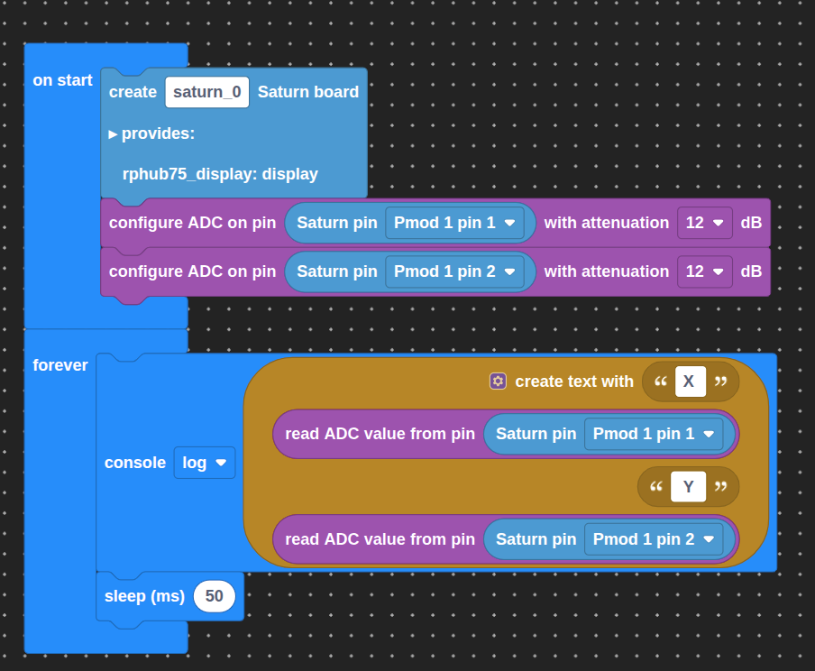
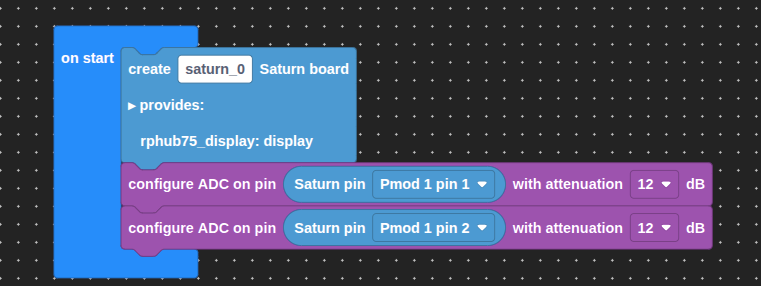
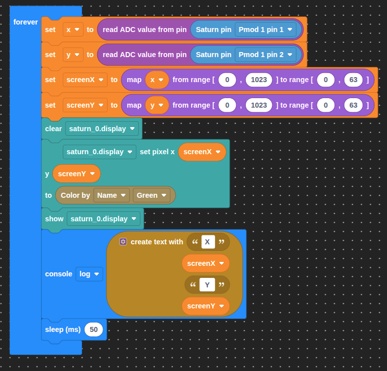
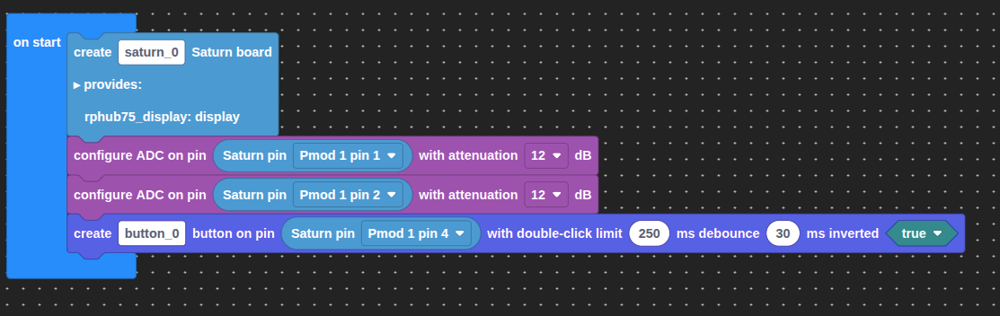
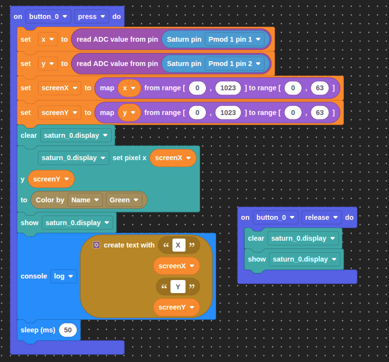

# Lekce 4.5 - Joystick a DPad


=== "Bločky"
    V této lekci se naučíme číst hodnoty z joysticku a převádět je na užitečné rozsahy pomocí funkce `map`.

    Joystick je zařízení, které nám umožňuje ovládat něco pohybem v ploše. Jedná se vlastně o dva potenciometry - jeden pro osu X a druhý pro osu Y. Protože potenciometry vracejí napětí, mikrokontrolér jej převede na číslo v rozsahu 0–1023.

    ## Vytvoření projektu

    Otevřeme editor [Jacly](https://jacly.jaculus.org/project) a vytvoříme nový projekt.
    Typ zvolíme `Jacly bloky projekt` a šablonu `template-jacly-saturn`.

    !!! warning "Pokročilá nastavení neměníme."

    ## Instalace knihoven

    Do nového projektu nainstalujeme potřebné knihovny:

    - `utils`
    - `button`

    ## Snímaní pozice joysticku
    
    
    
    Hodnotu z joysticku můžeme převést na jiný rozsah pomocí funkce `map` v záložce `Math`. Například pokud chceme pohybovat pixelem na displeji 64×64, potřebujeme rozsah 0–63.

    
    
    ## Tlačítko joysticku
    Tlačítko na joysticku je připojeno také na PMOD a pracuje s ním stejně jako jakékoli jiné tlačítko pomocí knihovny `button`.
    
    
    
    ## DPad
    DPad je jednoduchý modul se čtyřmi tlačítky (nahoru, dolů, vlevo, vpravo), který se používá například pro ovládání nebo navigaci. S tlačítky pracujeme pomocí stejné knihovny `button` jako u jakéhokoliv jiného tlačítka.
    
    
    
    ## Zadání A
    Přečti hodnoty X a Y osy joysticku a vypiš je do konzole každých 50 ms.
    
    ??? note "Řešení"
        
    
    ## Zadání B
    Pomocí `map` převeď hodnoty joysticku na souřadnice displeje 0–63 a zobraz jediný pixel na displeji.
    
    ??? note "Řešení"
        
        
        
    
    ## Zadání C
    Přidej reakci na tlačítko joysticku - při stisknutí rozsvít pixel na aktuální pozici, při puštění zhasni.
    
    ??? note "Řešení"
        
        
        
    
    ## Výstupní úkol V1 - Sledování pozice
    Vypisuj souřadnice joysticku v konzole průběžně.

    ## Výstupní úkol V2 - Barevný joystick
    Nastav barvu v závislosti na pozici joysticku - čím více doprava, tím více červené, čím více nahoru, tím více modré.


=== "TypeScript"
    V této lekci se naučíme číst hodnoty z joysticku a převádět je na užitečné rozsahy pomocí knihovny `utils`.

    === "Odkaz"
        Stačí kliknout na odkaz, otevře se nám VSCode a nabídne se nám možnost vytvořit projekt z připraveného balíčku.

        [Vytvořit projekt]( vscode://cubicap.jaculus/import?uri=https://2026.robotickytabor.cz/lekce/baseExample.tar.gz){.md-button .md-button--primary}
    === "Command line"
        Tento příkaz stačí zadat do terminálu v adresáři, kde chceme mít projekt uložený. Změníme `<PROJECT_NAME>` na název projektu, který chceme vytvořit.
        
        ```bash
        jac project-create --package https://2026.robotickytabor.cz/lekce/baseExample.tar.gz <PROJECT_NAME>
        ```

    Do nového projektu nainstalujeme potřebné knihovny:

    - `utils`
    - `button`

    ## Joystick

    Joystick je připojen k PMODu na Saturnu. Osa X je na pinu `1`, osa Y na pinu `2` a tlačítko na pinu `4`.

    Pro práci s piny použijeme objekt `SaturnPins` z knihovny `saturn`:

    ```ts
    import { SaturnPins } from "saturn";
    ```

    Hodnoty os jsou dostupné pomocí knihovny `adc`:

    ```ts
    import * as adc from "adc";
    import { SaturnPins } from "saturn";

    adc.configure(SaturnPins.Pmod1.Pin1);
    adc.configure(SaturnPins.Pmod1.Pin2);

    let x = adc.read(SaturnPins.Pmod1.Pin1);
    let y = adc.read(SaturnPins.Pmod1.Pin2);
    ```

    Analogová hodnota je v rozsahu `0`–`1023`. Pomocí `utils.map` ji můžeme převést na jiný rozsah:

    ```ts
    import * as utils from "utils";

    let screenX = utils.map(x, 0, 1023, 0, 63);
    let screenY = utils.map(y, 0, 1023, 0, 63);
    ```

    Tlačítko na joysticku se používá stejně jako jakékoli jiné tlačítko:

    ```ts
    import { Button } from "button";

    const btn = new Button(SaturnPins.Pmod1.Pin4);

    btn.on("press", () => {
        console.log("Button pressed");
    });

    btn.on("release", () => {
        console.log("Button released");
    });
    ```

    ## DPad

    DPad je modul se čtyřmi tlačítky (nahoru, dolů, vlevo, vpravo). Pro práci s nimi používáme stejnou knihovnu `button` jako u tlačítka na joysticku. Například:

    ```ts
    import { Button } from "button";
    import { SaturnPins } from "saturn";

    const btnUp = new Button(SaturnPins.Pmod1.Pin1);
    const btnDown = new Button(SaturnPins.Pmod1.Pin2);
    const btnLeft = new Button(SaturnPins.Pmod1.Pin3);
    const btnRight = new Button(SaturnPins.Pmod1.Pin4);

    btnUp.on("click", () => {
        console.log("Up");
    });

    btnDown.on("click", () => {
        console.log("Down");
    });

    btnLeft.on("click", () => {
        console.log("Left");
    });

    btnRight.on("click", () => {
        console.log("Right");
    });
    ```

    ## Zadání A

    Přečti hodnoty X a Y osy joysticku a vypiš je do konzole každých 50 ms.

    ??? note "Řešení"

        ```ts
        import * as adc from "adc";
        import { SaturnPins } from "saturn";

        adc.configure(SaturnPins.Pmod1.Pin1);
        adc.configure(SaturnPins.Pmod1.Pin2);

        setInterval(() => {
            let x = adc.read(SaturnPins.Pmod1.Pin1);
            let y = adc.read(SaturnPins.Pmod1.Pin2);
            console.log("X: " + x + ", Y: " + y);
        }, 50);
        ```

    ## Zadání B

    Pomocí `utils.map` převeď hodnoty joysticku na souřadnice displeje 0–63 a zobraz jediný pixel na displeji na této souřadnici.

    ??? note "Řešení"

        ```ts
        import * as adc from "adc";
        import * as utils from "utils";
        import { SaturnPins, createSaturn } from "saturn";
        import * as colors from "colors";

        adc.configure(SaturnPins.Pmod1.Pin1);
        adc.configure(SaturnPins.Pmod1.Pin2);
        const saturn = createSaturn();

        setInterval(() => {
            let x = adc.read(SaturnPins.Pmod1.Pin1);
            let y = adc.read(SaturnPins.Pmod1.Pin2);

            let screenX = utils.map(x, 0, 1023, 0, 63);
            let screenY = utils.map(y, 0, 1023, 0, 63);

            saturn.display.fill(colors.off);
            saturn.display.setPixel(screenX, screenY, colors.green);
            saturn.display.show();
        }, 50);
        ```

    ## Zadání C

    Přidej reakci na tlačítko joysticku - při stisknutí rozsvít pixel na aktuální pozici, při puštění zhasni.

    ??? note "Řešení"

        ```ts
        import * as adc from "adc";
        import * as utils from "utils";
        import { SaturnPins, createSaturn } from "saturn";
        import { Button } from "button";
        import * as colors from "colors";

        adc.configure(SaturnPins.Pmod1.Pin1);
        adc.configure(SaturnPins.Pmod1.Pin2);

        const btn = new Button(SaturnPins.Pmod1.Pin4);

        btn.on("press", () => {
            let x = adc.read(SaturnPins.Pmod1.Pin1);
            let y = adc.read(SaturnPins.Pmod1.Pin2);

            let screenX = utils.map(x, 0, 1023, 0, 63);
            let screenY = utils.map(y, 0, 1023, 0, 63);

            saturn.display.fill(colors.off);
            saturn.display.setPixel(screenX, screenY, colors.red);
            saturn.display.show();
        });

        btn.on("release", () => {
            saturn.display.fill(colors.off);
            saturn.display.show();
        });
        ```

    ## Výstupní úkol V1 - Barevný joystick

    Nastav barvu v závislosti na pozici joysticku - čím více doprava, tím více červené, čím více nahoru, tím více modré.
