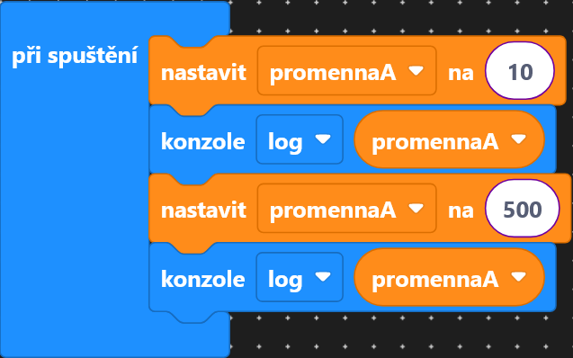
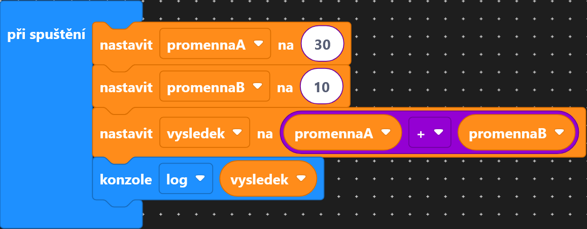
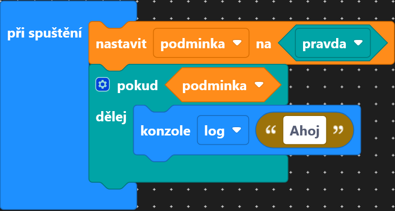
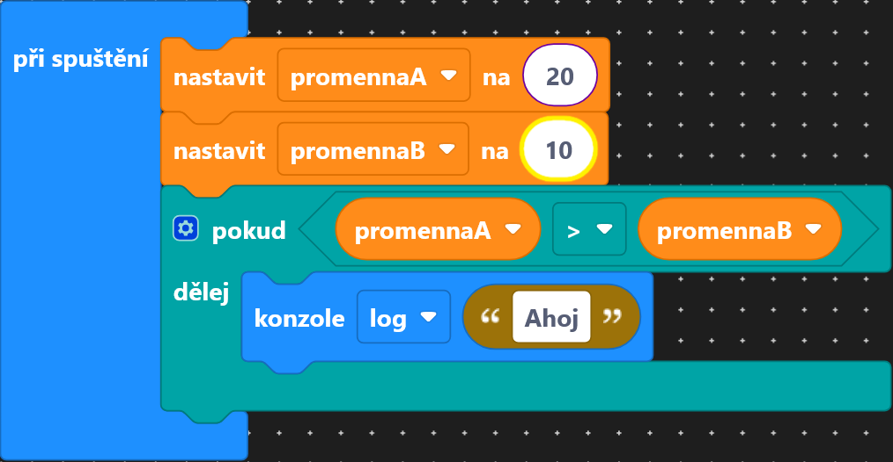
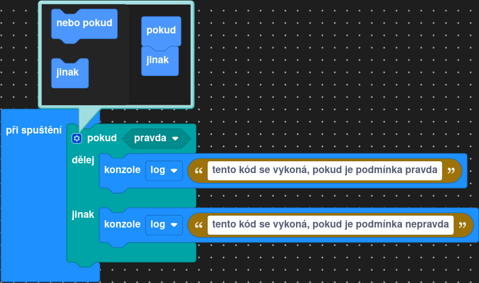
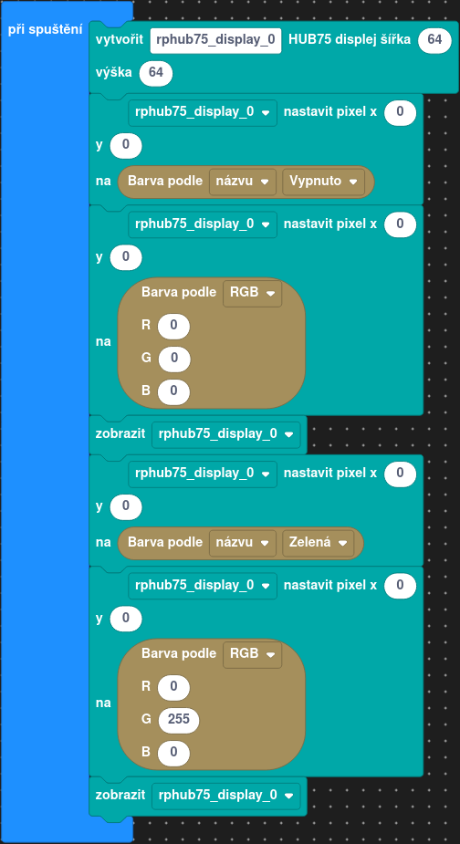
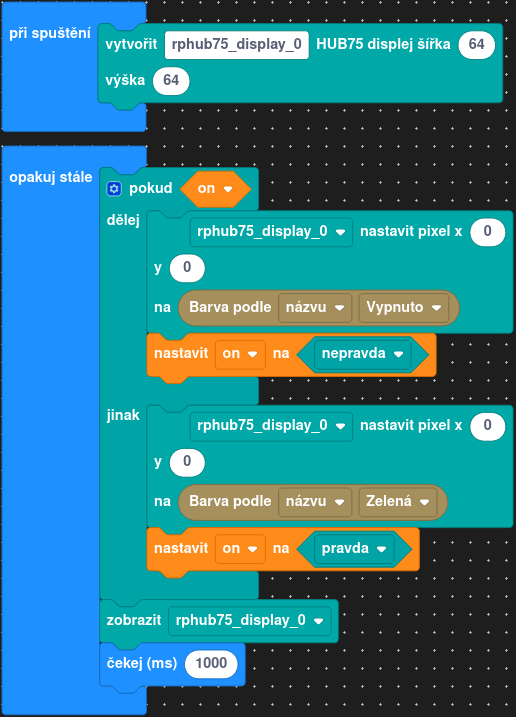
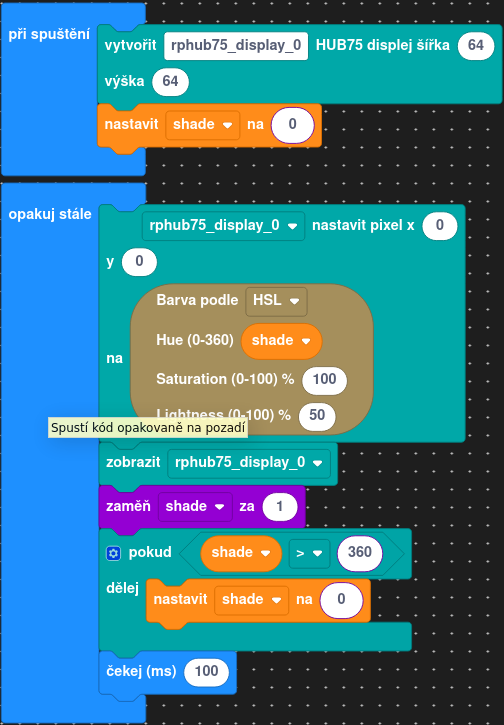
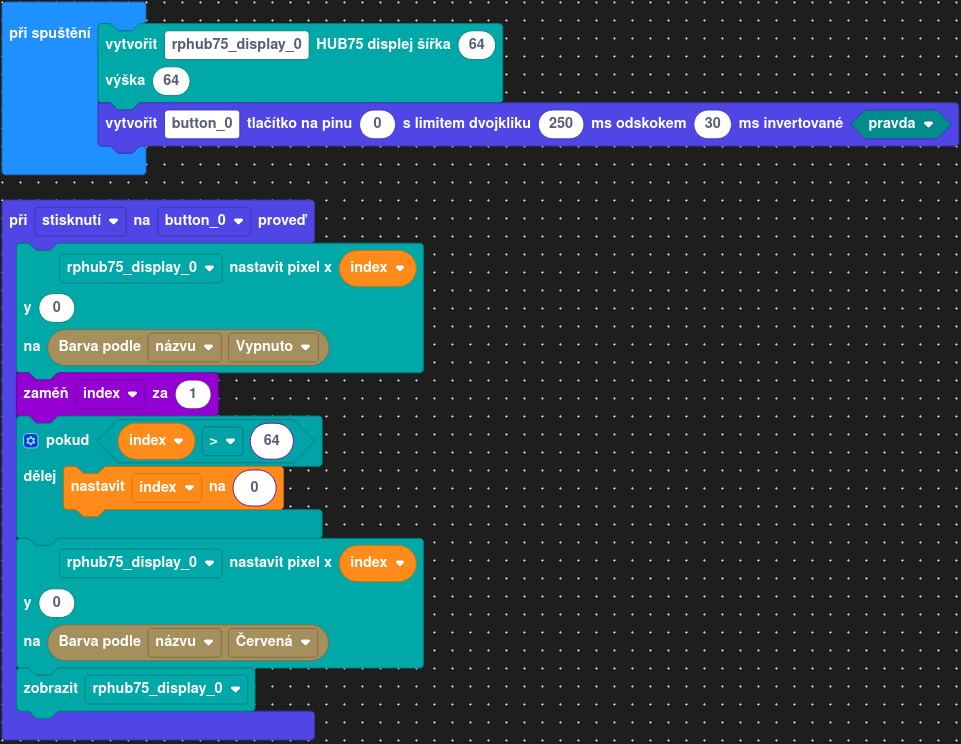
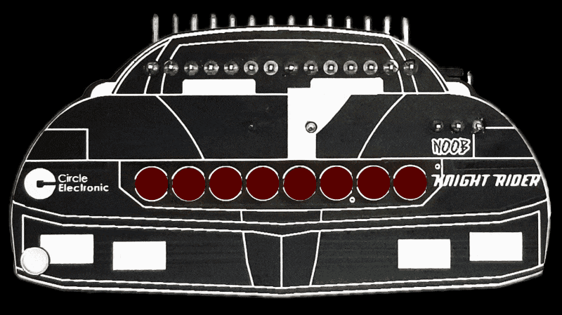

# Lekce 4 - Proměnné a podmínky

=== "Bločky"
    ## Proměnné
    V programování si držíme data a stav pomocí **proměnných**. Proměnné jsou pojmenované hodnoty,
    které můžeme měnit a opakovaně používat v různých částech kódu.

    Proměnnou vytvoříme pomocí rozkliknutí kategorie "Proměnné" a zmáčknutím tlačítka pro vytvoření proměnné, kterou si smysluplně pojmenujeme.

    Hodnoty přiřazujeme do proměnných pomocí bloku `nastavit <název proměnné> na`. Pokud chceme zadat do proměnné hodnotu, můžeme použít buď číselný blok z kategorie `Matematika`, nebo blok z kategorie "Logika" pro pravdivostní hodnoty `true` a `false`.

    

    S číselnými proměnnými můžeme provádět základní operace stejně jako s čísly.

    

    ## Podmínky
    Abychom na základě hodnot proměnných mohli měnit chování programu, potřebujeme **podmínky**.

    Pro práci s podmínkami používáme bločky z kategorie "Logika". Začneme bločkem "pokud". Ten nám umožňuje rozhodnout, jestli se určitý kus kódu vykoná, nebo ne.
    Používá k tomu pravdivostní hodnoty `true` (pravda) a `false` (nepravda).

    Například, pokud máme proměnnou `podmínka` typu boolean, pak následující kód:

    

    znamená:
    Pokud je `podmínka` pravda (`true`), program vytiskne do konzole `Ahoj`.
    Pokud je `podmínka` nepravda (`false`), program nevytiskne nic.

    Podmínky často používáme pro porovnávání čísel. Například:

    

    Všiměte si, že musíme použít speciální porovnávací bloček, který najdeme v kategorii "Logika".

    Porovnávat můžeme různými způsoby:

    - `=` zjistí, jestli jsou hodnoty stejné
    - `≠` zjistí, jestli jsou hodnoty nejsou stejné
    - `<` zjistí, jestli je první číslo menší než druhé
    - `>` zjistí, jestli je první číslo větší než druhé
    - `≤` a `≥` zjistí, jestli je menší/rovno nebo větší/rovno

    ### Pokud ... jinak
    Pokud chceme, aby se podle podmínky vykonal jeden nebo druhý kus kódu, použijeme `pokud ... jinak`.
    To uděláme tak, že klikneme na nastavovací tlačítko bloku `pokud` a v nově otevřeném okně si za blok `pokud` přidáme blok `jinak`.
    
    

    Takto můžeme jednoduše, co má program dělat podle různých situací.

    ### Barvy
    Za použití proměnných a podmínek rozsvítíme jeden pixel na displayi různými barvami.

    Barevné světlo vytváříme ze tří základních barev: červená (RED), zelená (GREEN), a modrá (BLUE).
    Tyto barvy mícháme v různých poměrech od 0 do 255, a vytváříme tak různé barvy:

    - První hodnota (r) nám dává množství červené (tedy např. hodnoty 100, 0, 0) rozsvítí LEDku červeně
    - Druhá (g) dává množství zelené
    - Třetí (b) dává množství modré

    Ve výchozím stavu je LED vypnutá (hodnoty `(0, 0, 0)`), a nejsilnější bílé světlo získáme použitím všech
    barev na maximum (hodnoty `(255, 255, 255)`).

    Druhou variantou je použití předdefinovaných barev z kategorie `Barvy`. Příklad použití obou variant:

    

    ## Zadání A

    Pomocí jedné proměnné se stavem a podmínky každou sekundu buď rozsvítíme, nebo zhasneme LEDku na displeji.

    
    ??? note "Řešení"
        

    ## Zadání B
    Pomocí bločku `Barva podle HSV` budeme procházet duhu. Jde o bloček, která dostane číslo od 0 do 360 a dá nám barvu na barevném spektru. Číslo budeme postupně zvyšovat a nastavovat barvu LEDky na `Barva podle HSV`. Pokud naše číslo přesáhne hodnotu `360`, musíme ho
    opět nastavit na `0`.

    ??? note "Řešení"
        

    ## Zadání C
    Tentokrát budeme reagovat na stisk tlačítka.

    Po stisku tlačítka zhasneme aktuální LEDku, a rozsvítíme tu další.
    Pokud při stisku tlačítka svítí poslední LED, zhasneme ji, a rozsvítíme opět první LED.

    Budete si muset nainstalovat balíček `button`.

    ??? note "Řešení"
        


    ## Výstupní úkol V1 - Knightrider

    Svítící LED "běhá" s danou rychlostí od začátku do konce displaye.
    Jakmile dorazí na konec, změní směr, a posouvá se opačným směrem.

    V našem případě bude stačit, když se bude pohybovat pouze jedna LEDka.

    

    !!! tip "Pro dobrovolníky"

        - Jezdec může při běhu měnit barvy.

        - Jezdec může zanechávat stopu: barva nezmizí hned, ale až s odstupem. Barva může "mizet" postupně: intenzita stopy se časem snižuje.

=== "TypeScript"
    <!-- TODO instalace knihovny rphub75 -->
    <!-- TODO instalace knihovny button -->
    === "Odkaz"
        Stačí kliknout na odkaz, otevře se nám VSCode a nabídne se nám možnost vytvořit projekt z připraveného balíčku.

        [Create project]( vscode://cubicap.jaculus/import?uri=https://2026.robotickytabor.cz/lekce/baseExample.tar.gz){.md-button .md-button--primary}
    === "VSCode extension"
        Otevřeme VSCode, v levém exploreru kliknema na extension `Jaculus` a tlačítko `Create Project`. Vybereme adresář, kde chceme mít projekt uložený a zadáme název projektu. Poté v menu vybereme možnost `Custom package URL` a zadáme toto URL: 
        
        `https://2026.robotickytabor.cz/lekce/baseExample.tar.gz`.
    === "Command line"
        Tento příkaz stačí zadat do terminálu v adresáři, kde chceme mít projekt uložený. Změníme `<PROJECT_NAME>` na název projektu, který chceme vytvořit.
        
        ```bash
        jac project-create --package https://2026.robotickytabor.cz/lekce/baseExample.tar.gz <PROJECT_NAME>
        ```
    === "Zip"
        Stáhneme si tento zip soubor, rozbalíme jej a otevřeme ve VSCode.
        
        [Zip soubor](https://2026.robotickytabor.cz/lekce/baseExample.zip){.md-button .md-button--primary}


    ### Proměnné
    V programování si držíme data a stav pomocí **proměnných**. Proměnné jsou pojmenované hodnoty, které můžeme měnit a opakovaně používat v různých částech kódu.

    Proměnná má svůj typ, který určuje, jaké hodnoty může proměnná mít. Proměnnou vytvoříme pomocí
    klíčového slova `let`.
    Každý jazyk má několik základních typů, zatím nám budou stačit dva:

    - **number**: základní číselný typ, může nabývat např. hodnot: `1`, `2`, `10`, `-5`, `0.5`
    - **boolean**: základní pravdivostní typ, který nabývá hodnot `true` a `false`

    Hodnoty přiřazujeme do proměnných pomocí operátoru `=`. Příklad použití:

    ```ts
    let first: number; // Vytvoří proměnnou se jménem first, a typem number
    first = 10; // Přiřadí do proměnné hodnotu 10
    first = 15; // Změní hodnotu proměnné na 15
    let second: number = 20; // Vytváření a přiřazení můžeme zkombinovat
    let truth: boolean = true; // Vytvoří proměnnou typu bool, která reprezentuje pravdu
    ```

    S proměnnými stejně jako s čísly můžeme provádět základní operace.

    ```ts
    let a: number = 10;
    let b: number = 5;
    let c: number = a + b; // c je 15
    let d: number = b - a; // d je -5
    ```
    Abychom na základě hodnot proměnných mohli měnit chování programu, potřebujeme **podmínky**.

    ### Podmínky
    Podmínka `if` nám umožňuje rozhodnout, jestli se určitý kus kódu vykoná, nebo ne.
    Používá se k tomu pravdivostní hodnoty `true` (pravda) a `false` (nepravda).

    Například, pokud máme proměnnou `podmínka` typu boolean, pak následující kód:

    ```ts
    let result: boolean = true;
    if (podmínka) {
      console.log("Ahoj");
    }
    ```

    znamená:
    Pokud je `podmínka` pravda (`true`), program vytiskne do konzole `Ahoj`.
    Pokud je `podmínka` nepravda (`false`), program nevytiskne nic.

    Podmínky často používáme i pro porovnávání čísel. Například:

    ```ts
    let first: number = 10;
    let second: number = 20;
    // ...
    if (first < second) {
      // tento kód se vykoná, pokud je první číslo menší než druhé
    }
    ```

    Porovnávat můžeme různými způsoby:

    - `==` zjistí, jestli jsou hodnoty stejné
    - `<` zjistí, jestli je první číslo menší než druhé
    - `>` zjistí, jestli je první číslo větší než druhé
    - `<=` a `>=` zjistí, jestli je menší/rovno nebo větší/rovno

    Pokud chceme, aby se podle podmínky vykonal jeden nebo druhý kus kódu, použijeme `if ... else`:

    ```ts
    if (podmínka) {
      // tento kód se vykoná, když je podmínka pravda
    } else {
      // tento kód se vykoná, když je podmínka nepravda
    }
    ```

    Takto můžeme řídit, co má program dělat podle různých situací.

    ### Barvy
    Za použití proměnných a podmínek rozsvítíme jeden pixel na displayi různými barvami.

    Barevné světlo vytváříme ze tří základních barev: červená (RED), zelená (GREEN), a modrá (BLUE).
    Tyto barvy mícháme v různých poměrech od 0 do 255, a vytváříme tak různé barvy:

    - První hodnota (r) nám dává množství červené (tedy např. hodnoty 100, 0, 0) rozsvítí LEDku červeně
    - Druhá (g) dává množství zelené
    - Třetí (b) dává množství modré

    Ve výchozím stavu je LED vypnutá (hodnoty `(0, 0, 0)`), a nejsilnější bílé světlo získáme použitím všech
    barev na maximum (hodnoty `(255, 255, 255)`).

    Druhou variantou je použití předdefinovaných barev z knihovny `colors`. 

    ```ts
    display.setPixel(0, 0, colors.off); // Vypne LEDku pomocí předdefinované barvy
    display.setPixel(0, 0, colors.rgb(0, 0, 0)); // Vypne LEDku pomocí vlastní barvy
    display.show();

    display.setPixel(0, 0, colors.green); // Rozsvítí LEDku zeleně pomocí předdefinované barvy
    display.setPixel(0, 0, colors.rgb(0, 255, 0)); // Rozsvítí LEDku zeleně pomocí vlastní barvy
    display.show();
    ```

    ## Zadání A

    Pomocí jedné proměnné se stavem a podmínky každou sekundu buď rozsvítíme, nebo zhasneme LEDku na displeji.

    ??? tip "Řešení"

        ```ts
        import * as colors from "colors";
        import { createSaturn } from "saturn";

        const saturn = createSaturn();
        const display = saturn.display;

        let on: boolean = false; // LED je vypnutá

        setInterval(() => {
          if (on) {
            // Pokud je LED zapnutá
            display.setPixel(0, 0, colors.off); // Vypneme LED
            display.show(); // Zobrazíme změny
            on = false;
          } else {
            display.setPixel(0, 0, colors.green); // Rozsvítíme LED zelenou barvou
            display.show(); // Zobrazíme změny
            on = true;
          }
        }, 1000);
        ```

    ## Zadání B

    Pomocí funkce `colors.rainbow` budeme procházet duhu. Jde o funkci (o těch si povíme trochu více později), která dostane číslo od 0 do 360,
    a na základě toho vrátí barvu na barevném spektru. V daném intervalu (např. 100 ms) budeme postupně zvyšovat číslo a nastavovat barvu LEDky na `colors.rainbow(cislo)`. Pokud naše číslo přesáhne hodnotu `360`, musíme ho
    opět nastavit na `0`.

    ??? tip "Řešení"

        ```ts
        import * as colors from "colors";
        import { createSaturn } from "saturn";

        const saturn = createSaturn();
        const display = saturn.display;

        let shade = 0; // Držíme si stav s aktuálním odstínem

        setInterval(() => {
          display.setPixel(0, 0, colors.rainbow(shade)); // Nastavíme LED na aktuální odstín
          display.show(); // Zobrazíme změny
            shade = shade + 1; // Zvedneme odstín (lze i shade += 1)
            if (shade > 360) {
              shade = 0;
            }
        }, 100);
        ```

    ## Zadání C

    Tentokrát budeme reagovat na stisk tlačítka.

    Po stisku tlačítka zhasneme aktuální LEDku, a rozsvítíme tu další.
    Pokud při stisku tlačítka svítí poslední LED, zhasneme ji, a rozsvítíme opět první LED.

    ??? tip "Řešení"

        ```ts
        import * as colors from "colors";
        import { Button } from "button";

        import { createSaturn, SaturnPins } from "saturn";

        const saturn = createSaturn();
        const display = saturn.display;

        let button: Button = new Button(SaturnPins.BootBtn); 

        let index: number = 0;
        let color: Rgb = colors.light_blue; // Vybereme si barvu
        display.setPixel(0, 0, color); // Nastavíme LED na aktuální odstín
        display.show(); // Zobrazíme změny

        button.on("click", () => {
          display.setPixel(index, 0, colors.off); // Vypneme předchozí LED
          index = index + 1; // Zvedneme index (lze i index += 1)
          if (index >= 63) {
            // Pokud jsme mimo rozsah displaye, vrátíme se na začátek
            index = 0;
          }
          display.setPixel(index, 0, color); // Nastavíme aktuální LED
          display.show(); // Zobrazíme změny
        });
        ```

    ## Výstupní úkol V1 - Knightrider

    Svítící LED "běhá" s danou rychlostí od začátku do konce displaye.
    Jakmile dorazí na konec, změní směr, a posouvá se opačným směrem.

    V našem případě bude stačit, když se bude pohybovat pouze jedna LEDka.

    

    !!! tip "Pro dobrovolníky"

        - Jezdec může při běhu měnit barvy (např. pomocí funkce `rainbow`)

        - Jezdec může zanechávat stopu: barva nezmizí hned, ale až s odstupem. Barva může "mizet" postupně: intenzita stopy se časem snižuje.
