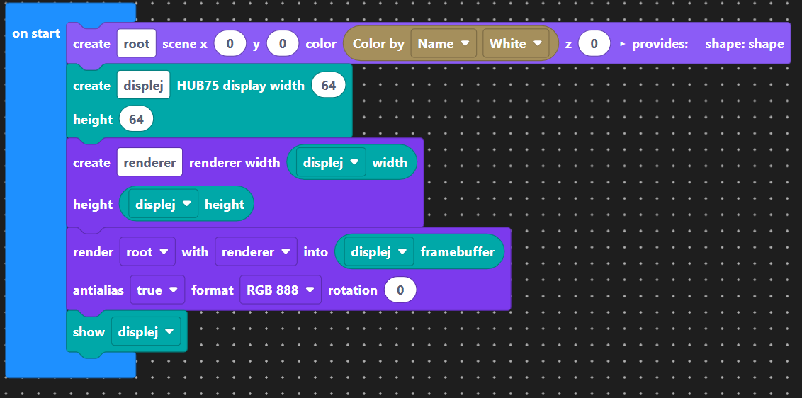
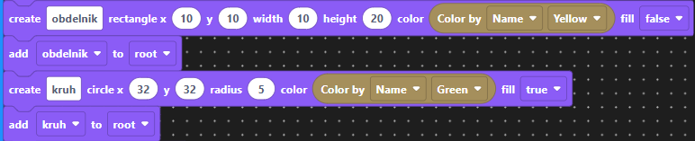
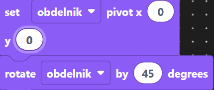

# Lekce 5 - Vektorová grafika
V přechozích lekcích jsme viděli, jak ovládat jednotlivé pixely displeje. V této lekci si ukážeme jak vykreslovat složitější tvary a struktury.

## Jednoduché tvary

Ještě než začneme s vykreslováním jednoduchých tvarů, je potřeba si připravit kostru projektu:

=== "Typescript"
    ```ts
    import { Display } from "rphub75";
    import { rgb } from "colors";
    import * as colors from "colors";
    import { Renderer, Format, Font, Texture } from "renderer";
    import { Circle, Rectangle, Point, LineSegment, Collection } from "shapes";

    const root = new Collection({ x: 0, y: 0, color: colors.white, z: 0 });

    // Sem vepisujte vlastní kod

    const display = new Display();
    const renderer = new Renderer(display.width, display.height);
    renderer.render(root, display.frame, true, Format.RGB_888);
    display.show();
    ```
=== "Bločky"
    

Nejdříve si vykreslíme jednoduchý prázdný čtverec a vyplněný kruh:
=== "TypeScript"
    ```ts
    const obdelnik = new Rectangle({x: 10, y: 10, width: 10, height:20, color: colors.yellow})
    root.add(obdelnik)
    const kruh = new Circle({x: 32, y: 32, radius: 5, color: colors.green, fill: true})
    root.add(kruh)
    ```
=== "Bločky"
    

!!! warning "Každý tvar musíme přidat do kolekce, kterou poté renderer vykresluje, nebo do nějaké její podkolekce" 

### Rotace
Vyzkoušíme si ještě rotace. Před prováděním rotací je dobré nastavit si bod (pivot), kolem kterého se bude tvar otáčet

=== "TypeScript"
    ```ts
    obdelnik.setPivot(0,0)
    obdelnik.rotate(45)
    ```
=== "Bločky"
    
Celý dosavadní kód by měl vypadat nějak takto:
```ts
import { Display } from "rphub75";
import { rgb } from "colors";
import * as colors from "colors";
import { Renderer, Format, Font, Texture } from "renderer";
import { Circle, Rectangle, Point, LineSegment, Collection } from "shapes";

const root = new Collection({ x: 0, y: 0, color: colors.white, z: 0 });

const obdelnik = new Rectangle({x: 10, y: 10, width: 10, height:20, color: colors.yellow})
root.add(obdelnik)
obdelnik.setPivot(0, 0)
obdelnik.rotate(45)

const kruh = new Circle({x: 32, y: 32, radius: 5, color: colors.green, fill: true})
root.add(kruh)

const display = new Display();
const renderer = new Renderer(display.width, display.height);
renderer.render(root, display.frame, true, Format.RGB_888);
display.show();
```
!!! note "Všiměte si, že nastavení pivota na souřadnice 0, 0 vede k rotaci okolo rohu čtverce, ne okolo pixelu se souřadnicemi 0, 0. Jak bychom to museli udělat, kdybychom chtěli více tvarů otáčet kolem jednoho středu?"

## Kolekce

Kolekce jsou speciální grafické prvky, které se vyznačují tím, že můžou obsahovat jiné grafické prvky, včetně kolekcí. Když provedeme posunutí, škálování, nebo rotaci kolekce, tak se tato operace projeví na všech členech této kolekce.

Když jsme zadávali souřadnice geometrických tvarů v předchozích příkladech, tak jsme ve skutečnosti nezadávali konkrétní pozice pixelů na displeji, ale souřadnice relativní vzhledem ke kořenové (root) kolekci, do které jsme museli přidat všechny prvky, které měly být viditelné.

## Úkol A
Změňte v našem programu parametry root kolekce. Jak se to projeví na výstupu?


## Výstupní úloha V1
Vhodným složením trojúhelníku a obdélníku nakreslete domeček.