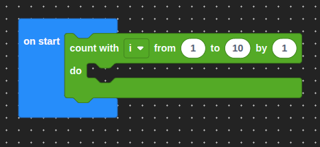
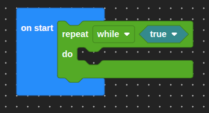
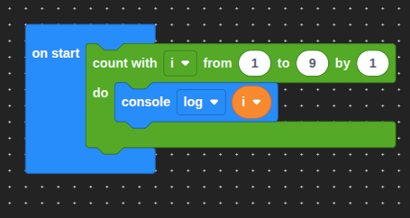
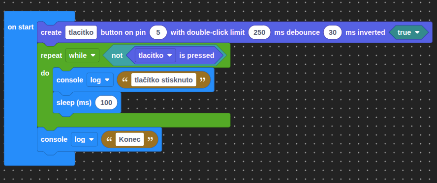
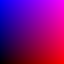
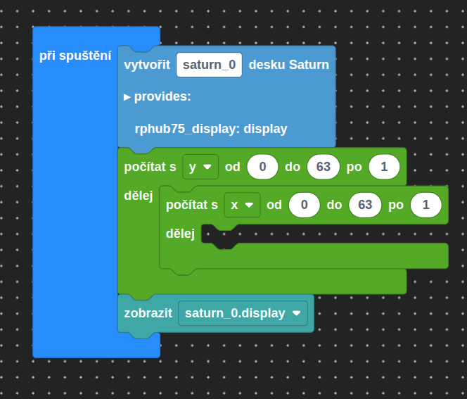
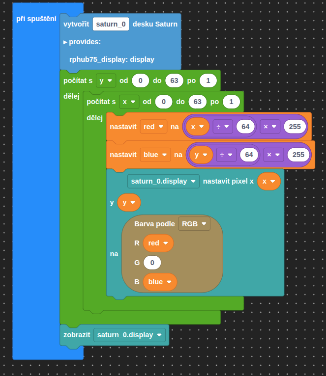

# Lekce 6 - Cykly

=== "Bločky"
    V této lekci si představíme cykly. Ty nám umožňují opakovat kód podle nějakého pravidla.
    Zatím je využijeme pro kreslení složitějších tvarů na obrazovce.

    Máme primárně dva typy cyklů:
    
    - for cyklus
    
    
    
    - while cyklus
    
    
    
    ### Cyklus for

    Cyklus `#!ts for` vypadá takto:
    
    

    Má tři parametry:

    - řídící proměnnou s její výchozí hodnotou
    - konečnou hodnotu
    - nakonec o kolik se bude zvětšovat proměnná
    
    Tedy vytváříme proměnnou `#!ts i` s výchozí hodnotou `#!ts 1`, která bude existovat po dobu vykonávání cyklu.
    Ačkoliv v běžném životě počítáme věci od `1`, v informatice častěji začínáme `0`. Může zde však být cokoliv.

    Následně máme konečnou hodnotu, která určuje, jak dlouho cyklus bude běžet.

    Na konci cyklu zvýšíme `#!ts i ` o jedna.

    Při prvním průchodu bude tedy `#!ts i = 0`, při druhém `#!ts i = 1`, a při třetím `#!ts i = 2`. Až bude platit `#!ts i = 10`, tak cyklus se tedy ukončí.

    Dovnitř bločku dáme kód který chceme opakovat.

    ## Zadání A

    Ve spojení se znalostmi z minulých lekcí napište program, který postupně vypíše čísla 0 až 9 (pomocí `#!ts console.log(CISLO)`), vždy na samostatný řádek. Využijte cyklus.

    ??? note "Řešení"

        

    ## Cyklus while

    Pokud nevíme, kolikrát se má cyklus opakovat, použijeme místo cyklu `#!ts for ` cyklus `#!ts while `.

    Do kulatých závorek teď píšeme jen výraz, který určuje, jestli se cyklus vykoná znovu, nebo ne. Funguje prakticky jako podmínka, která se opakuje.
    Kód, který se má vykonávat, dokud platí podmínka, může vypadat třeba takto:
    
    
    
    !!! warning "Upozornění"
    
        Nezapomeň si nainstalovat balíček Button!
    
    ## Zadání B
    
    !!! warning "Upozornění"
    
        Pro tohle zadání je potřeba si nainstalovat balíček Saturn. S tím pak má být bloček Saturn pro správné fungování displeje
    
    Teď vyzkoušíme nakreslit gradient modré a červené na displeji, tak aby se po ose X zvětšovala hodnota červené a po ose Y zvětšovala hodnota modré. Výsledek byl měl vypadat takhle:

    

    Musíme si uvědomit, že cykly mohou být vloženy do sebe. Využijte dva for cykly, jeden v druhém, aby jste mohli projít všechny pixely na displeji.
    Jeden prochází řádky, zatímco druhý už prochází každý pixel ve vybraném řádku.

    ??? tip "Nápověda"
        
        Zde příklad jak vytvořit vložené for cykly:
        

    ??? note "Řešení"

        

    ## Zadání výstupního úkolu V1

    Napište program, který který vypíše čísla od 9 do 0.
    Zadání je velmi podobné jako zadání A, jen jdou čísla sestupně namísto vzestupně. Nekopírujte jen dodaný kód, ale zkuste si jej napsat sami.

    ## Zadání výstupního úkolu V2

    Napište program, který vytvoří vodorovný gradient ze zelené na žlutou.

    ## Zadání výstupního úkolu V3

    Váš poslední úkol je vytvořit šachovnici, tak že se vykreslí bílá jen kdy součet souřadnic je lichý. Využij zbytek po dělení`.

    
=== "TypeScript"


    ## Vytvoření projektu

    Jak jsme se učili v první lekci, vytvoříme si nový projekt. Máme několik možností, jak to udělat:
    === "Odkaz"
        Stačí kliknout na odkaz, otevře se nám VSCode a nabídne se nám možnost vytvořit projekt z připraveného balíčku.

        [Vytvořit projekt]( vscode://cubicap.jaculus/import?uri=https://2026.robotickytabor.cz/lekce/baseExample.tar.gz){.md-button .md-button--primary}
    === "Command line"
        Tento příkaz stačí zadat do terminálu v adresáři, kde chceme mít projekt uložený. Změníme `<PROJECT_NAME>` na název projektu, který chceme vytvořit.
            
        ```bash
        jac project-create --package https://2026.robotickytabor.cz/lekce/baseExample.tar.gz <PROJECT_NAME>
        ```

    ## Instalace knihoven

    Do nového projektu nainstalujeme potřebné knihovny:

    - `button`

    V této lekci si představíme cykly. Ty nám umožňují opakovat kód podle nějakého pravidla.
    Zatím je využijeme pro kreslení složitějších tvarů na obrazovce.

    Máme primárně dva typy cyklů:

    - `#!ts for()` využijeme, když víme počet opakování
    - `#!ts while()` využijeme, když nevíme počet opakování

    ### Cyklus for

    Cyklus `#!ts for` můžeme napsat takto:

    ```ts
    for (let i: number = 0; i < 3; i++) {
    // opakovaný kód
    }
    ```

    Do kulatých závorek píšeme tři věci:

    - řídící proměnnou s její výchozí hodnotou
    - výraz, který určuje počet opakování
    - nakonec jednoduchou operaci, která se provede při každém průchodu cyklem jako poslední operace

    Tedy vytváříme proměnnou `#!ts i` s výchozí hodnotou `#!ts 0`, která bude existovat po dobu vykonávání cyklu.
    Ačkoliv v běžném životě počítáme věci od `1`, v informatice častěji začínáme `0`. Může zde však být cokoliv.

    Následně definujeme výraz `#!ts i < 3 `, který určuje, za jakých podmínek má cyklus běžet.

    Na konci cyklu zvýšíme `#!ts i ` o jedna.

    Při prvním průchodu bude tedy `#!ts i = 0`, při druhém `#!ts i = 1`, a při třetím `#!ts i = 2`. Při dalším zvyšování by platilo `#!ts i = 3`, tam ale už nebude pravdivý výraz `i < 3` a cyklus se tedy ukončí.

    Do složených závorek píšeme vykonávaný kód, který se v tomto případě vykoná 3-krát.

    ## Zadání A

    Ve spojení se znalostmi z minulých lekcí napište program, který postupně vypíše čísla 0 až 9 (pomocí `#!ts console.log(CISLO)`), vždy na samostatný řádek. Využijte cyklus.

    ??? note "Řešení"

        ```ts
        for (let i: number = 0; i < 10; i++) { // vypíšeme čísla od 0 do 9
            console.log(i);
            await sleep(100); // menší opoždění, aby bylo vidět jak se to postupně vypisuje.
        }
        console.log("Čísla vypsána!");

        ```


    ## Cyklus while

    Pokud nevíme, kolikrát se má cyklus opakovat, použijeme místo cyklu `#!ts for ` cyklus `#!ts while `.

    Do kulatých závorek teď píšeme jen výraz, který určuje, jestli se cyklus vykoná znovu, nebo ne. Funguje prakticky jako podmínka, která se opakuje.
    Kód, který se má vykonávat, dokud platí podmínka, může vypadat třeba takto:

    ```ts
    import { Button } from "button";
    
    import { SaturnPins } from "saturn";

    const button = new Button(SaturnPins.Pmod1.Pin1); // změň na pin kde máš svoje tlačítko zapojené
    while (!button.isPressed()) {
    // cyklus kontroluje, zdali je tlačítko zmáčknuté (gpio.read() vrací 1, pokud
    // je tlačítko zmáčknuté), dokud není zmáčknuté, vypisuje "NOT PRESSED"
    console.log("NOT PRESSED");
    // await sleep() čeká 100ms před dalším průchodem cyklu,
    // bez něj by se příliš rychle vypisovalo "NOT PRESSED"
    // (ve skutečnosti ne, Jaculus by takový program automaticky ukončil)
    await sleep(100);
    }
    console.log("END");
    ```

    ## Zadání B

    Teď vyzkoušíme nakreslit gradient modré a červené na displeji, tak aby se po ose X zvětšovala hodnota červené a po ose Y zvětšovala hodnota modré. Výsledek byl měl vypadat takhle:

    


    Musíme si uvědomit, že cykly mohou být vloženy do sebe. Využijte dva `#!ts for` cykly, jeden v druhém, aby jste mohli projít všechny pixely na displeji.
    Jeden prochází řádky, zatímco druhý už prochází každý pixel ve vybraném řádku.

    ??? tip "Nápověda"
        Zde příklad jak vytvořit vložené for cykly:
        
        ```ts
        
        import { createSaturn } from "saturn";

        const sat = createSaturn();
        
        // tento for loop prochází řádky, po Y od 0 do 64 (výška displeje)
        for (let y = 0; y < sat.display.height;y++) { 
            // tento for loop prochází už každý bod na určeném řádku, po X od 0 do 64 (šířka displeje)
            for (let x = 0; x <sat.display.width;x++){
                //ZDE vykresluj pixely a vypočítej správné hodnoty barvy
            }
        }

        ```


    ??? note "Řešení"

        ```ts
        import { rgb } from "colors";
        import { createSaturn } from "saturn";

        const sat = createSaturn();

        // tento for loop prochází řádky, po Y od 0 do 64 (výška displeje)
        for (let y = 0; y < sat.display.height;y++) { 
            // tento for loop prochází už každý bod na určeném řádku, po X od 0 do 64 (šířka displeje)
            for (let x = 0; x <sat.display.width;x++){ 
                // přepočítáme souřadnici X tak, aby jsme dostali celý rozsah červené
                let red = (x/sat.display.width)*255;
                // přepočítáme souřadnici Y tak, aby jsme dostali celý rozsah modré
                let blue = (y/sat.display.height)*255;
                
                // pomocí dříve vypočítaných hodnotách nastavíme barvu na vybraný pixel.
                sat.display.setPixel(x,y,rgb(red,0,blue));
            }
        }
        // Nakonec vyzobrazíme všechny pixely na displeji.
        sat.display.show();
        ```

    ## Zadání výstupního úkolu V1

    Napište program, který který vypíše čísla od 9 do 0.
    Zadání je velmi podobné jako zadání A, jen jdou čísla sestupně namísto vzestupně. Nekopírujte jen dodaný kód, ale zkuste si jej napsat sami.

    ## Zadání výstupního úkolu V2

    Napište program, který vytvoří vodorovný gradient ze zelené na žlutou.

    ## Zadání výstupního úkolu V3

    Váš poslední úkol je vytvořit šachovnici, tak že se vykreslí bílá jen kdy součet souřadnic je lichý. Využij modulo (`#!ts % `), který dává na výstup zbytek z dělení `#!ts 15 % 8 = 7`.
