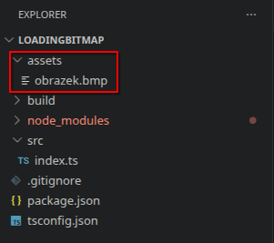

# Renderer

Knihovna `shapes` definuje tvary, ze kterých se skládají scény na displeji Saturnu, knihovna `renderer` pak obsahuje nástroje pro jejich vykreslení (např. třídu `Renderer`, kterou pod kapotou používá `game-loop`). Tato stránka popisuje jednotlivé tvary, jejich společné vlastnosti (pozice, rotace, měřítko, textury) a hlavně to, jak fungují kolekce (skupiny tvarů) a jak se v nich sčítají transformace.

## Základní tvary

Všechny tvary dědí ze společné třídy `Shape` a barevné tvary navíc implementují rozhraní `Colorable` (metody `setColor`/`getColor`). Konstruktoru každého tvaru se předává objekt s parametry – vždy obsahuje alespoň `x` a `y`, volitelně `z` (pořadí vykreslování, viz `setZ`/`getZ`).

```ts
import { Circle, Rectangle, Polygon, LineSegment, Point, RegularPolygon } from "shapes";
```

### Circle

Kruh (při nerovnoměrném měřítku se vykreslí jako elipsa).

```ts
new Circle({ x: 32, y: 32, radius: 8, color: 0xff0000, fill: true });
```

- `setRadius(radius)` / `getRadius()` – poloměr.
- `setFill(fill)` / `getFill()` – zda je kruh vyplněný, nebo jen obrys.

### Rectangle

Obdélník.

```ts
new Rectangle({ x: 0, y: 0, width: 10, height: 5, color: 0x00ff00 });
```

- `setWidth(width)` / `getWidth()`
- `setHeight(height)` / `getHeight()`
- `setFill(fill)` / `getFill()`

### Polygon

Libovolný mnohoúhelník zadaný seznamem vrcholů.

```ts
new Polygon({ x: 0, y: 0, vertices: [[0, 0], [10, 0], [5, 10]], color: 0x0000ff });
```

- `setVertices(vertices)` / `getVertices()` – pole dvojic `[x, y]`.
- `setFill(fill)` / `getFill()`

### RegularPolygon

Pravidelný mnohoúhelník. Velikost lze zadat buď poloměrem opsané kružnice (`radius`), nebo délkou strany (`sideLength`).

```ts
new RegularPolygon({ x: 32, y: 32, sides: 6, radius: 10, color: 0xffff00 });
```

- `setSides(sides)` / `getSides()` – počet stran.
- `setRadius(radius)` / `getRadius()`
- `setFill(fill)` / `getFill()`

### LineSegment

Úsečka. Počáteční bod je společná pozice `x`/`y`, koncový bod se nastavuje zvlášť.

```ts
new LineSegment({ x: 0, y: 0, x2: 10, y2: 10, color: 0xffffff });
```

- `setEndpoint(x2, y2)` – nastaví koncový bod.
- `getX2()` / `getY2()` – souřadnice koncového bodu.

### Point

Jeden pixel dané barvy.

```ts
new Point({ x: 32, y: 32, color: 0xffffff });
```

## Společné vlastnosti tvarů (`Shape`)

Každý tvar (a tedy i kolekce) má pozici, rotaci a měřítko, které lze měnit následujícími metodami:

- `setPosition(x, y)` – nastaví absolutní pozici.
- `translate(dx, dy)` – posune tvar relativně vůči jeho aktuální pozici.
- `setX(x)` / `setY(y)` / `getX()` / `getY()` – jednotlivé souřadnice.
- `setZ(z)` / `getZ()` – pořadí vykreslování (tvary s vyšším `z` se kreslí "nad" tvary s nižším `z`).
- `rotate(angle)` – otočí tvar o `angle` stupňů okolo aktuálního pivotu (relativně k aktuálnímu natočení).
- `setRotationAngle(angle)` / `getRotationAngle()` – nastaví/přečte absolutní úhel natočení.
- `setPivot(x, y)` – nastaví bod, okolo kterého se provádí následující rotace.
- `setScale(scaleX, scaleY, originX?, originY?)` – nastaví měřítko a volitelně i bod, od kterého se škáluje.
- `setScaleX(scaleX)` / `setScaleY(scaleY)` / `getScaleX()` / `getScaleY()`
- `intersects(other)` – otestuje, zda se tvar protíná s jiným tvarem (pro detekci kolizí).

### Transformační matice

Pro pokročilé případy (zkosení, animace řízená zvenčí), které se nedají vyjádřit kombinací pozice/rotace/měřítka, lze nastavit vlastní 2D transformační matici:

```ts
shape.setTransformationMatrix({ a: 1, b: 0, c: 0, d: 1, e: 0, f: 0 });
```

Matice má tvar

```
| a  c  e |
| b  d  f |
| 0  0  1 |
```

kde `a`/`d` je měřítko na ose X/Y (v kombinaci s `b`/`c` i rotace a zkosení) a `e`/`f` je posun. Dokud je matice nastavena, **přepisuje** efekt `setPosition`/`translate`/`rotate`/`setScale` – ty přestanou mít na tvar vliv. Zpět na běžné chování se lze vrátit voláním `clearTransformationMatrix()`.

Pro pochopení a experimentování s tím, jak se jednotlivé hodnoty matice projeví, může pomoct [transformation matrix playground](https://tinylittlemaggie.github.io/transformation-matrix-playground/).

### Textury

Barevné vlastnosti tvarů lze nahradit texturou (`Texture` z knihovny `renderer`):

- `setTexture(texture)` – napojí texturu na tvar.
- `setFixTexture(fixed)` – když `true`, souřadnice textury zůstanou pevné ve světovém prostoru (tvar se pod texturou "posouvá"), místo aby se texturovaly relativně k tvaru.
- `setTextureRotation(rotation)`, `setTextureOffset(offsetX, offsetY)`, `setTextureScale(scaleX, scaleY)` – natočení, posun a měřítko vzorkování textury na tvaru.
- `setUVRotation`, `setUVOffsetX`/`setUVOffsetY`, `setUVScaleX`/`setUVScaleY` – obdobné jemnější nastavení UV souřadnic.

### Jak načíst textury do Jaculus

Aby jste mohli nastavit své obrázky jako textury tvarů, musíte je přesunout do Saturnu.

!!! danger "Upozornění"
    `Renderer` umí ukázat jenom Bitmap obrázky (`.bmp`)!
    Pomocí [online converteru](https://convert.town/jpg-to-bmp) si můžete překonvertovat na správný formát.

Ve svém projektu si vytvořte složku `assets` v **kořenové** složce projektu. Tam si dejte obrázky v formátu BMP. Projekt by měl vypadat například takto:



Poté se textura dá načíst takhle, kde `#!ts "{JMENO_SOUBORU}.bmp"` změňte za svůj obrázek:

```ts
const obrazek = new Texture();
obrazek.load("/data/code/assets/{JMENO_SOUBORU}.bmp")
```
Funkce `load` vyhodí `boolean` zda se textura uspěšně načetla. Využívejte toho aby jste předešli errorům.
Zde je minimální příkladový kód pro zobrazení textury na čtverci:

```ts
import { GameLoop } from "game-loop";
import { createSaturn } from "saturn";
import { Rectangle } from "shapes";
import * as colors from "colors";
import { Texture } from "renderer";

let sat = createSaturn();
let loop = new GameLoop(sat.display);
// vytvoříme si tvar na kterém chceme načíst texturu
const ctverec = new Rectangle({x: 10, y: 0, color: colors.red, width:40, height:40, fill:true});
loop.addShape(ctverec);
// vytvoříme objekt Texture:
const obrazek = new Texture();
// nastaví aby se textura posouvala s objektem
ctverec.setFixTexture(true);

// if podmínka pro kontrolu zda obrázek v systému existuje, pokud ne tak vypíše error:
const nactene = obrazek.load("/data/code/assets/obrazek.bmp");
if(nactene) {
    ctverec.setTexture(obrazek);
} else {
    console.error("Obrázek nebylo možné načíst!");
}
```

## Kolekce (`Collection`)

`Collection` je tvar, který slouží jako **skupina jiných tvarů** – i kolekcí navzájem (kolekce se dají libovolně vnořovat). Sama dědí ze `Shape`, takže má pozici, rotaci, pivot i měřítko úplně stejně jako kterýkoliv jiný tvar.

```ts
import { Collection, Circle, Rectangle } from "shapes";

const group = new Collection({ x: 32, y: 32 });
group.add(new Circle({ x: 0, y: 0, radius: 4, color: 0xff0000 }));
group.add(new Rectangle({ x: 10, y: 0, width: 4, height: 4, color: 0x00ff00 }));
```

- `add(shape)` – přidá tvar do kolekce.
- `remove(shape)` – odebere tvar z kolekce.
- `clear()` – odebere všechny tvary z kolekce.

Scéna, kterou zobrazuje `game-loop`/`Renderer`, je vždy jedna kořenová `Collection`, do které se přidávají všechny ostatní tvary a podskupiny.

Ruční skládání kolekcí a jejich transformací může být zdlouhavé – místo psaní kódu nazpaměť lze scénu poskládat vizuálně v builderu scén, který celý proces práce s kolekcemi zjednodušuje a na konci vygeneruje hotový TypeScript kód.

[Builder scén](../scene-builder/builder.html){ .md-button }

### Jak se skládají transformace v kolekci

Tvary uvnitř kolekce mají svoje **vlastní** souřadnice `x`/`y`, rotaci a měřítko – ty jsou vztažené ke kolekci, ne k celé scéně. Transformace kolekce se pak aplikuje na výsledek:

- Souřadnice dítěte (`x`, `y`) se berou jako pozice v **lokálním** prostoru kolekce – teprve poté se na ně aplikuje posun, rotace a měřítko kolekce (a případně jejích rodičovských kolekcí, pokud je kolekce vnořená).
- **Rotace kolekce otáčí i všechny její potomky** – pokud kolekci otočíte pomocí `rotate()`, otočí se okolo jejího pivotu (výchozí pivot je pozice kolekce, lze změnit `setPivot`) a s ní i všechny tvary uvnitř, včetně jejich vlastní pozice v kolekci (tvar na okraji skupiny opíše při rotaci kolekce oblouk okolo jejího středu).
- Vlastní rotace tvaru (`shape.rotate()`) se aplikuje navíc, nezávisle na rotaci kolekce – otáčí tvarem okolo jeho vlastního pivotu, ne okolo středu kolekce. Výsledné natočení tvaru na scéně je tedy kombinací jeho vlastní rotace a rotace všech kolekcí, do kterých je vnořen.
- Stejně tak se **sčítá měřítko**: měřítko kolekce škáluje i pozice a velikosti všech potomků (i vzdálenost tvaru od středu kolekce), zatímco vlastní `setScale` tvaru mění jen jeho velikost.
- `translate`/`setPosition` volané na kolekci posune celou skupinu najednou – vnitřní souřadnice tvarů zůstávají stejné, mění se jen společný posun.

Díky tomu je kolekce vhodná např. pro sestavení složeného objektu (třeba robota z více tvarů), který chcete jako celek posouvat a otáčet, aniž byste museli přepočítávat pozici každého dílčího tvaru zvlášť – stačí otáčet/posouvat kolekci a vnitřní tvary "jedou s ní".

```ts
const robot = new Collection({ x: 32, y: 32 });
robot.add(new Rectangle({ x: -4, y: -4, width: 8, height: 8, color: 0xffffff })); // tělo
robot.add(new LineSegment({ x: 0, y: 0, x2: 8, y2: 0, color: 0xff0000 })); // "nos" ukazující směr

loop.on("tick", () => {
    robot.rotate(2); // celý robot (i s nosem) se otáčí okolo svého středu
});
```

### Z-order v kolekcích

Hodnota `z` (`setZ`/`getZ`) určuje pořadí vykreslování v rámci kolekce, do které je tvar přidán – tvary s vyšším `z` se vykreslují nad tvary s nižším `z`.

## Formáty pixelů (`Format`)

Konstruktoru `Renderer` se předává formát výstupních pixelů (`Format.RGB_565_LITTLE`, `Format.RGBA_8888` apod.) a volitelná rotace celého obrazu po 90° krocích – v běžném použití přes `game-loop`/`saturn` se ale s `Renderer` a `Format` pracovat nemusí, o vykreslování se stará knihovna sama.
