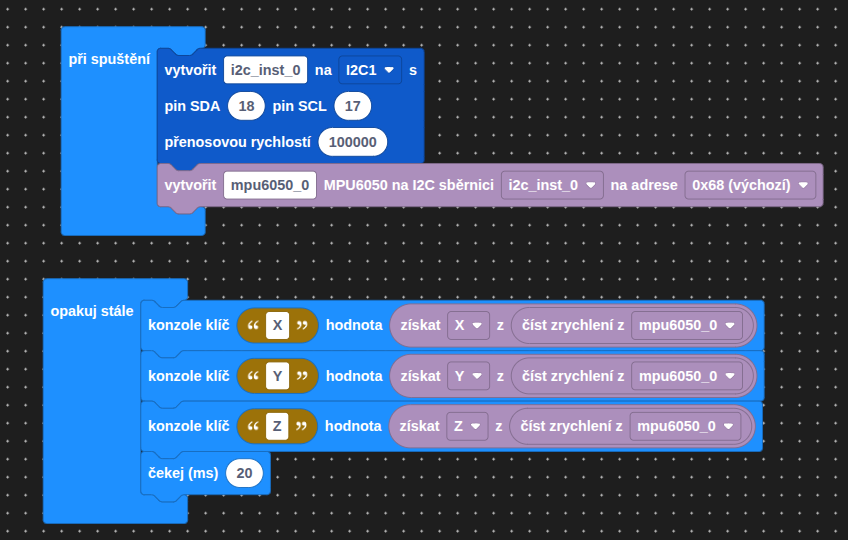
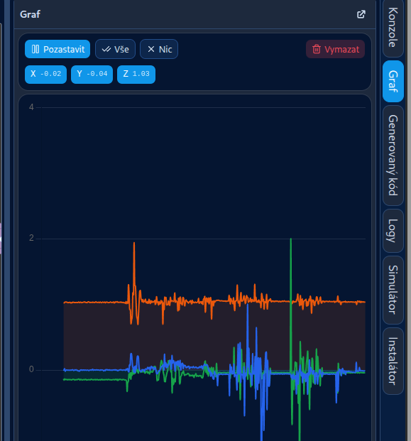

# Akcelerometr a gyroskop

Jeden z modulů, které si můžeme připojit k RoboDecku je MPU6050 -- Integrovaný gyroskop a akcelerometr v jednom pouzdru. 

## Akcelerometr

Akcelerometr měří zrychlení (změnu v rychlosti v čase). Poku si ho dáme do auta, bude nám například schopen říct, jak prudce jsme zabrzdili. Akcelerometr dokáže měřit taky gravitační zrychlení, a může nám proto říct "kde je dole", toho využívají například mobily, aby mohly přecházet mezi režimy "na výšku" a "na šířku" podle toho, jak je mobil natočený. Tady toto měření orientace vůči Zemi je sice užitečné, ale má svá omezení: Pokud se otočí akcelerometr kolem svislé osy, tak si toho téměř nevšimne.

## Gyroskop

Gyroskop nám řekne, jak rychle, a kolem které osy se otáčí. Jelikož není ovlivněný gravitací, tak je schopný detekovat i otočení kolem svislé osy. Gyroskopy se často používají k odhadování orientace podobně jako akcelerometry. Pokud známe výchozí orientaci a rychlost a směr otáčení, můžeme postupným sčítáním spočítat současnou pozici. Je ale potřeba si pohlídat tzv. drift. Gyroskop zaznamenává pomalé otáčení i když se ve skutečnosti nehýbe a postupně se tak vzdaluje od skutečné orientace. Toto můžeme řešit použitím nějakého referenčního senzoru, například kompasu, nebo akcelerometru.

## Instalace knihoven

Do projektu je potřeba nainstalovat:

`mpu6050`

## Jak to použít

=== "Bločky"
    Stejnou věc můžeme sestavit i v bločkách. Nejprve si v kategorii `mpu6050` vytvoříme I2C sběrnici a na ní pak senzor MPU6050 na výchozí adrese `0x68`. V nekonečné smyčce pak z něj přečteme zrychlení a jednotlivé osy X, Y, Z vypíšeme do konzole.

    

    Blok `konzole klíč` posílá hodnotu do konzole pod daným klíčem (`X`, `Y`, `Z`), díky čemuž je Jacly umí zobrazit jako tři barevné křivky v `Grafu`.

    

=== "TypeScript"
    Senzor používá ke komunikaci sběrnici I2C a musíme ji proto inicializovat před použitím

    ```ts
    I2C1.setup({scl: 17, sda: 18})
    const sensor = new MPU6050(I2C1)
    ```

    Zrychlení a rotaci pak můžeme získat zavoláním následujících funkcí:

    ```ts
    let [accX, accY, accZ] = sensor.getAcceleration();
    let [rotX, rotY, rotZ] = sensor.getAngularVelocity();
    ```

    Zrychlení je udávané v násobcích zemské gravitace. Pokud naměříme akcelerometrem v nějaké ose hodnotu 2, tak to znamená že na něj v té dané ose působí zrychlení 2G, dvojnásobek zemské gravitace.

    Rychlost otáčení se udává ve stupních za sekundu.
