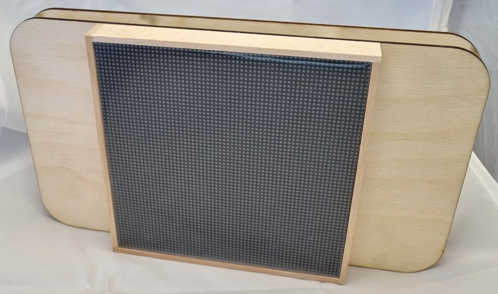

# Stavba Robodecku

Na této stránce najdete podrobný návod na stavbu Robodecku, který je hlavním výrobkem letošního tábora.

Výroba je rozdělena na čtyři části:

1. [Pájení destičky](kroky/01-pajeni.md)
2. [Stavba rámečku](kroky/02-ramecek.md)
3. [Spojení předchozích dvou částí](kroky/03-spojeni.md)
4. [Dokončení](kroky/04-dokonceni.md)

!!! danger "Upozornění"
	Není první dva body lze udělat v libovolném pořadí. Je proto možné začít bodem číslo 2. (rámeček), pokud nebude u pájení místo.
