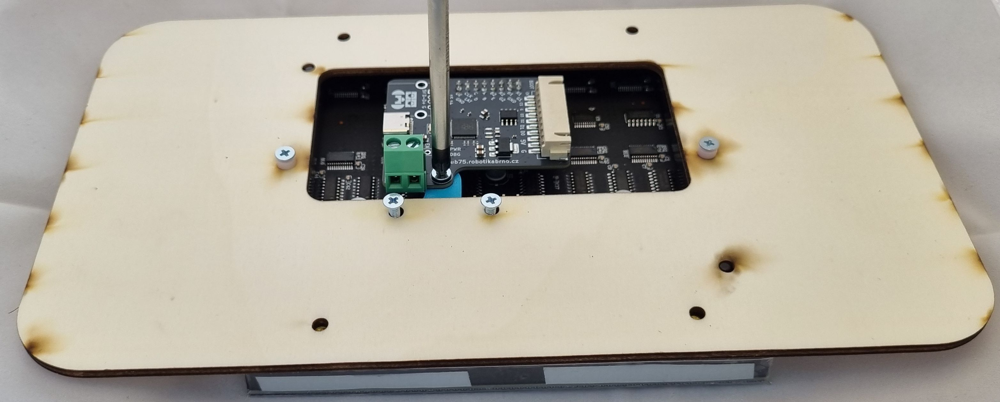
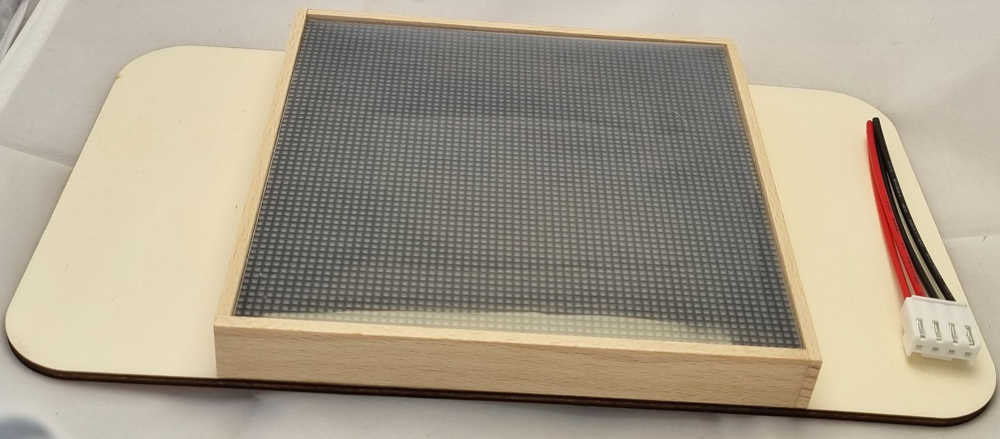
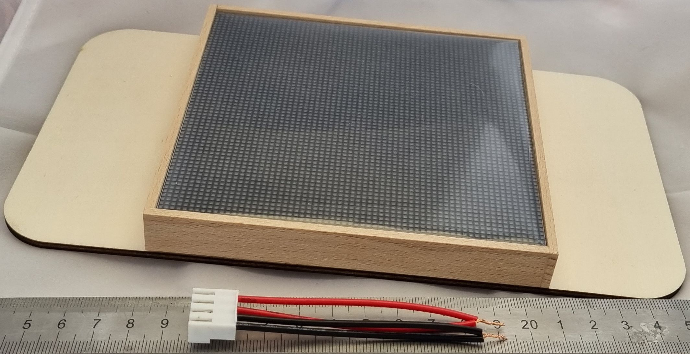
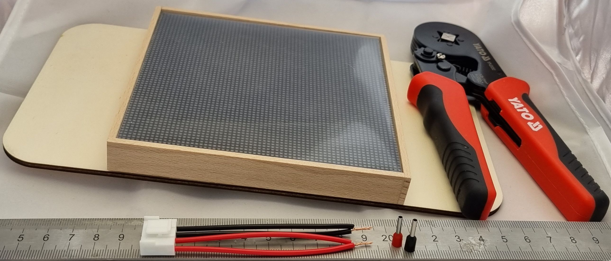
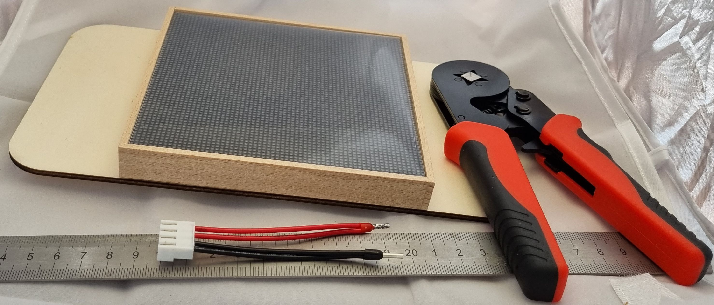
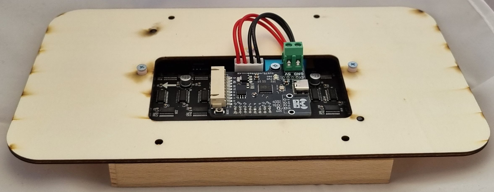
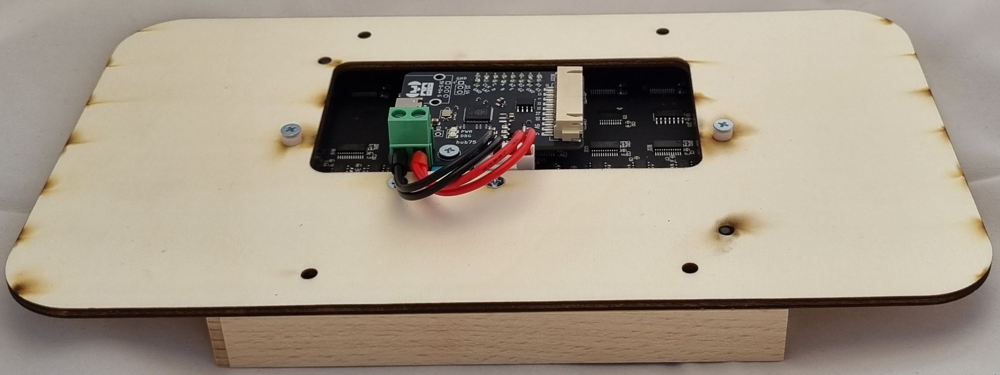

# Spojení

!!! danger "Upozornění"
    K tomuto kroku už je zapotřebí mít hotový rámeček a spájenou destičku. Pokud je nemáš, vrať se zpět na předchozí kroky.

[Zpět](../index.md){ .md-button }

---

Začneme přišroubování RP-Hubu k displeji. Na toto budeme potřebovat jeden šroubek. Před šroubováním je potřeba RP-hub zapojit do konektoru displeje. 

---

Následně si zajdeme pro cca 8 cm dlouhý konektorový kabel. 

---

!!! warning "Upozornění"
    Následující pasáž je velmi citlivá na chybu. Pokud si čímkoli nejsi jist, nestyď se zeptat ORGa. Pokud bys udělal chybu, tak by se ti Robodeck mohl rozbít a už by nebyly náhradní díly.

Zhruba jeden cm na jeho konci odizolujeme.

---

Odizolovaný kabel nejdříve zamotáme samotný. Následně zamotáme **STEJNÉ BARVY** do sebe.

---

Po zamotání nasadíme dutinku a zakrympujeme.

!!! warning "Upozornění"
    V krympovacích kleštích držíme jen kovovou část dutinky

---

Kabel následně připojíme do konektoru na RP-Hubu a do konektoru na displeji. Červená patří do 5V, černá do GND.

---

[Zpět](../index.md){ .md-button }
[Pokračovat na dokončení](04-dokonceni.md){ .md-button }