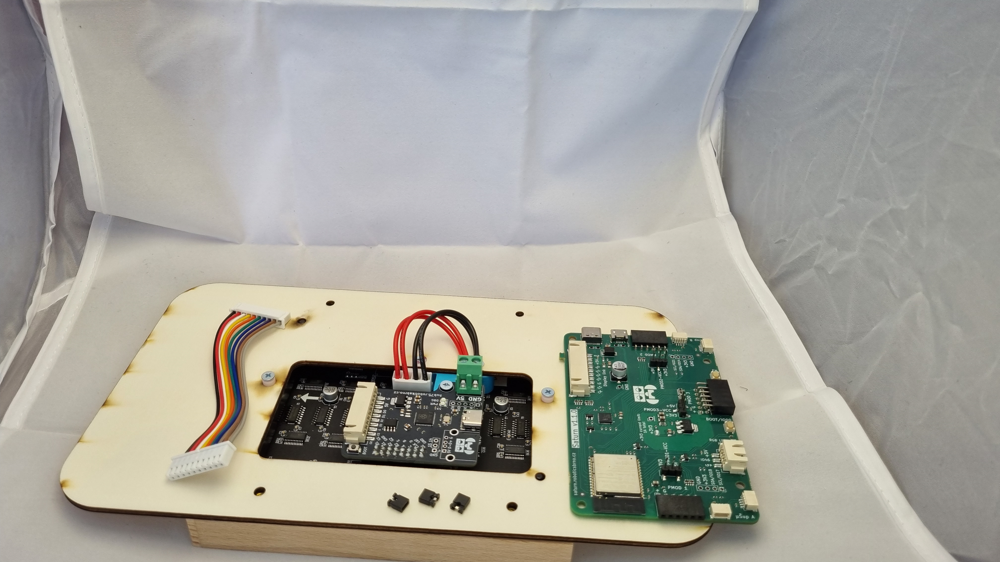
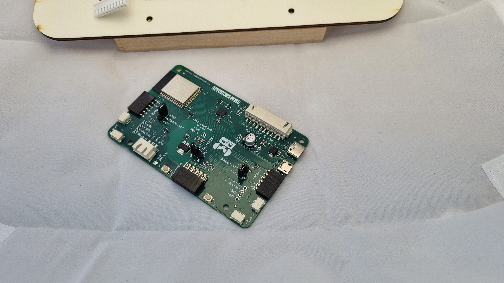
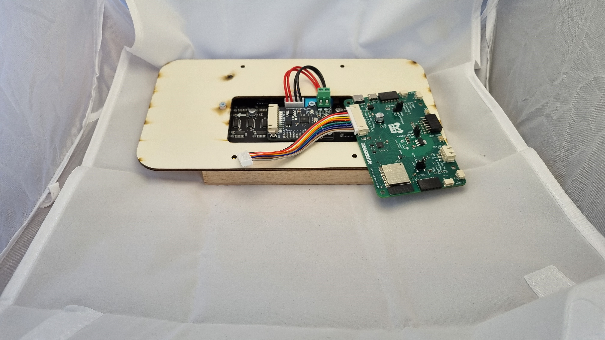
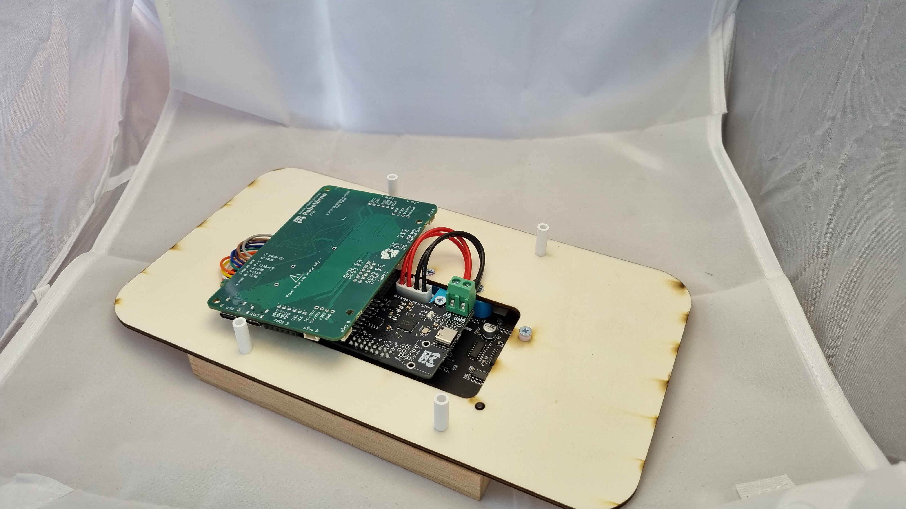
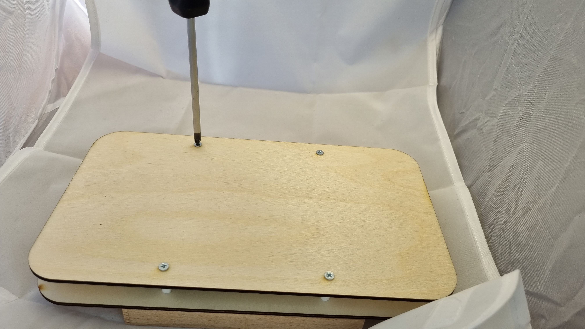
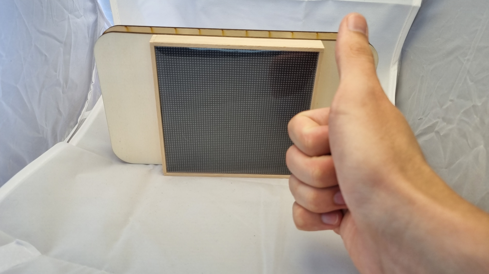

# Dokončení

!!! danger "Upozornění"
    K tomuto kroku už je zapotřebí mít hotový rámeček, spájenou destičku a opojí propojeno konektorem. Pokud je nemáš, vrať se zpět na předchozí kroky.

[Zpět](../index.md){ .md-button }

Vezmeme si zelenou destičku Saturn, která je mozkém celého zařízení. 

Začneme umístěním jumperů. My chceme na tomto táboře mít verzi na 3,3V. Proto jumpery umístíme takto:

!!! danger "Upozornění"
    Pokud si s jumpery nejsi jistý, zeptej se ORGa. Pokud je umístíš špatně, tak by se ti Robodeck mohl rozbít a už by nebyly náhradní díly.

Velkým barevným konektorem připojíme destičku Saturn k RP-Hubu.

Na desku dáme distanční sloupky (dlouhé bílé roury).

Po distančních sloupcích umístíme poslední dřevěnou desku a připevníme ji šrouby.

Po zašroubování poslední desky je Robodeck hotový. Gratulujeme!

[Zpět](../index.md){ .md-button }
[Na lekce](../../../lekce){ .md-button }