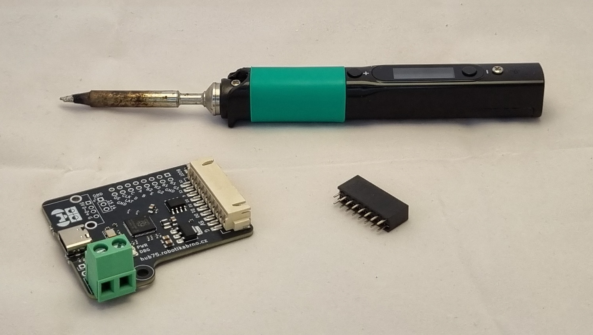
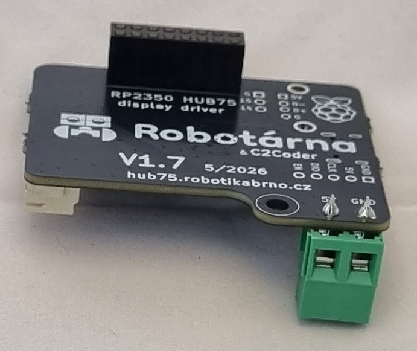

# Pájení

!!! danger "Upozornění"
	K pájení slouží pouze pájecí stanoviště! Nikde mimo ně pájku nepoužívej.

Pájení je proces, při kterém se spojují kovové součástky pomocí roztaveného kovu (cínu). V našem případě budeme pájet součástky na destičku, která je součástí Robodecku.

Začneme tím, že si připravíme všechny potřebné součástky. Bude to DPS RP-Hub a dutinková lišta, kterou budeme pájet na DPS. Dále budeme potřebovat páječku, cín a tavidlo. 

Dutinkovou lištu zasuneme do DPS RP-Hubu tak, aby byla ideálně kolmo z druhé strany, nez ostatní vystouplé konektory.

Tím je pájení hotové. Nyní je potřeba zkontrolovat, zda jsou všechny spoje dobře připájené. Zeptej se ORGa a pak pokračuj v sestatvování Robodecku:

[Zpět](../index.md){ .md-button }
[Pokračovat na rámeček](ramecek.md){ .md-button }
[Už mám dřevěný rámeček](spojeni.md){ .md-button }

