# Rámeček

Začneme tím, že si zajdeme pro čtyři dřevíčka na rámeček. 

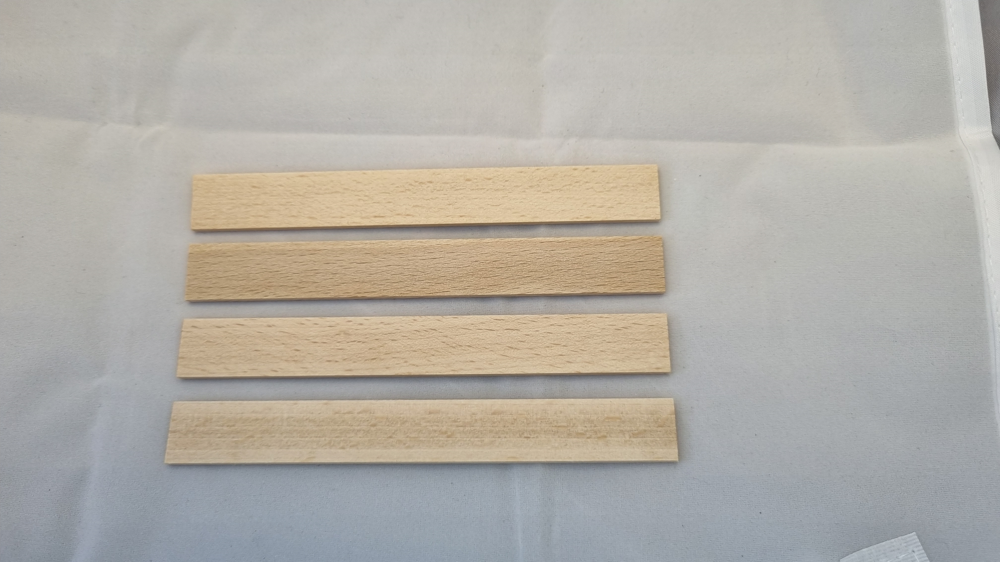

S nimi přijdeme na stůl lepení, kde budeme potřebovat lepidlo, svorky a plastový rámeček, který nám pomůže udržet dřevíčka v pravém úhlu a správném rozměru. 

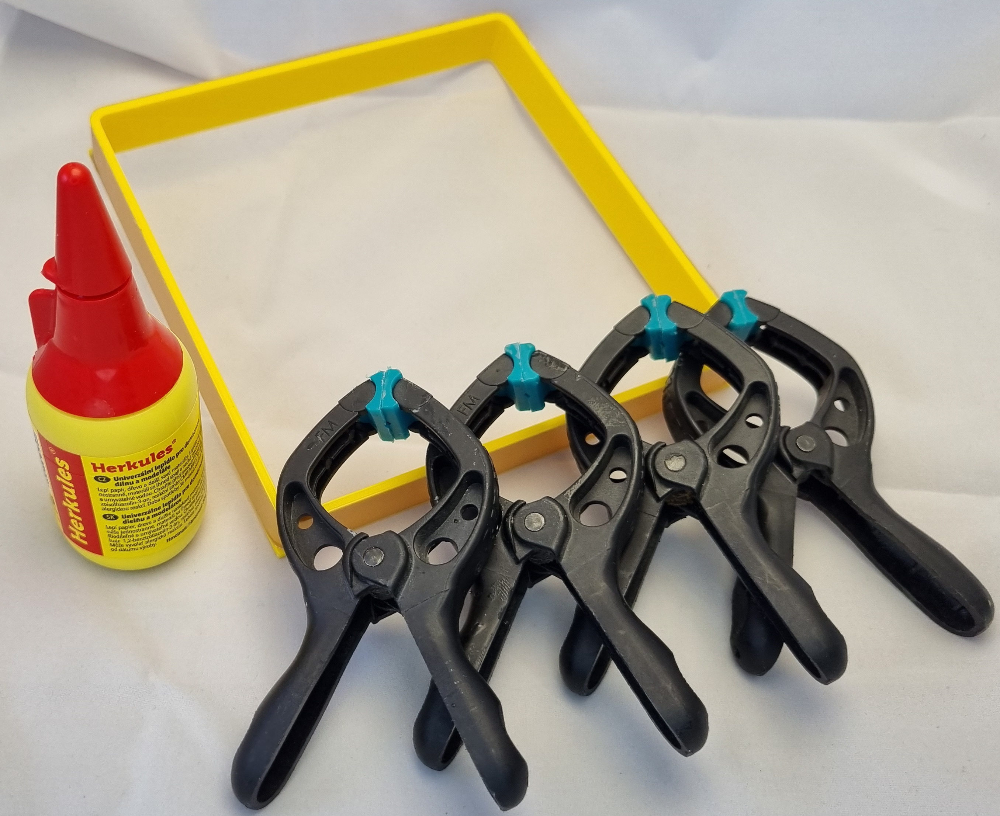

Začneme přiložením prvního dřevíčka k plastovému rámečku. Je zde důležité, aby bylo dřevíčko zarovnáno s s okrajem rámečku, u kterého končí, protože jinak by se nám rámeček nepodařilo složit. Po přiložení a zarovnání dřevíčka zajistíme svorkou.

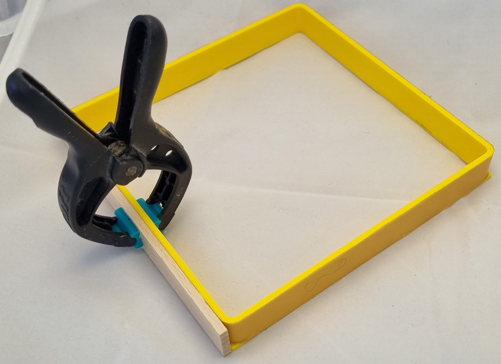

Nyní na zarovnanou stranu přiložíme druhé dřevíčko a opět ho zarovnáme s okrajem plastového rámečku. Po zarovnání zajistíme svorkou. Není potřeba aby pasovali dřívko na dřívko, ale hlavně aby byl nový kousek dřívka zarovnaný s plastovým rámečkem.

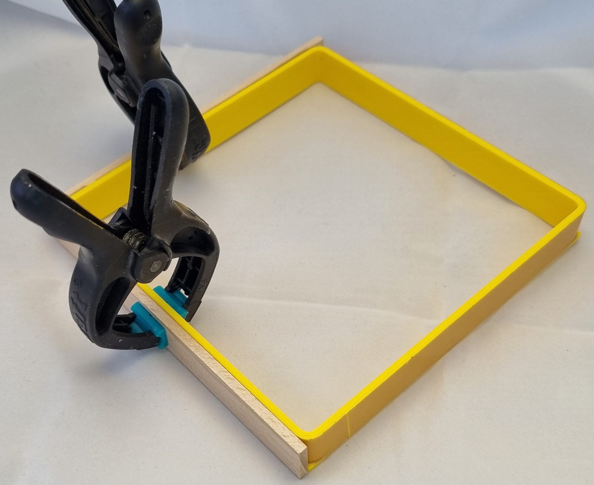

!!! danger "Upozornění"
    Není potřeba, aby dřevíčka byla přesně na sobě, ale hlavně aby byla zarovnaná s plastovým rámečkem. Pokud by byla dřevíčka posunutá, tak by se nám rámeček nepodařilo složit.

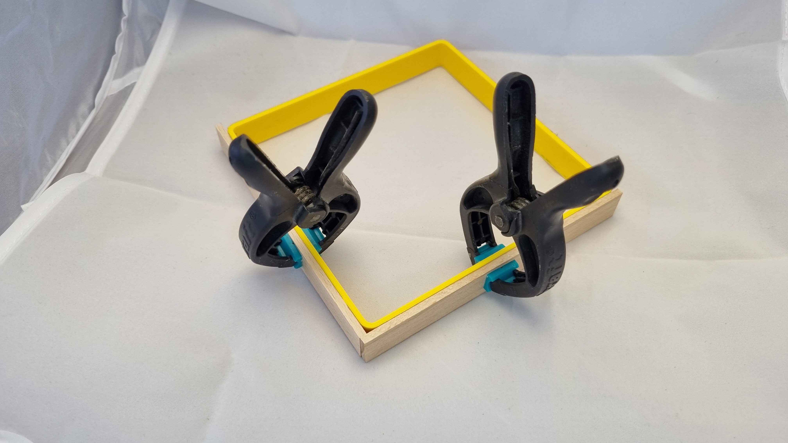

Stejným postupem přiložíme třetí a čtvrté dřevíčko. Po přiložení všech dřevíček je potřeba je zajistit svorkami, aby se nám při lepení nepohnuly. Počkáme asi 10 minut, než lepidlo zaschne a můžeme rámeček vyjmout z plastového rámečku.

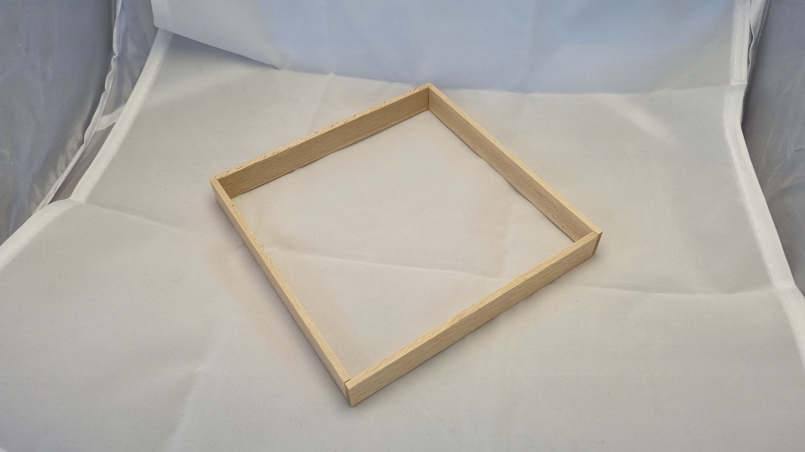

Plastový rámeček už nebudeme potřebovat, takže ho odložíme a můžeme pokračovat v lepení. Vezmeme displej a OPATRNĚ ho položíme diodami dolů. 

!!! danger "Upozornění"
    Displej je křehký, takže s ním manipulujte opatrně. Ledky se rády odlomí a displej se může rozbít. Displejů je málo, takže pokud se rozbije, tak už nebude náhradní.

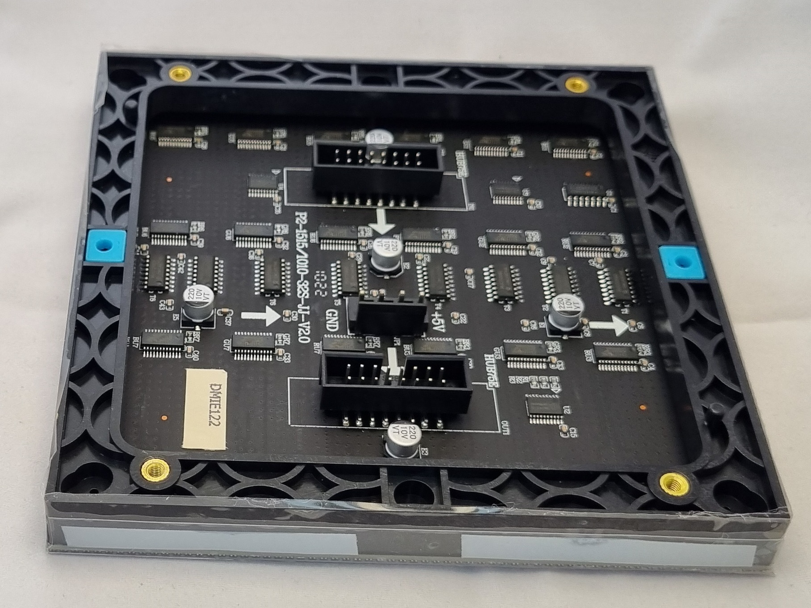

Displej orientujeme tak, aby šipky ukazovali doprava a dolů. Do rámečku displeje vložíme RP-Hub holder (takový ten výrazný modrý kus plastu).

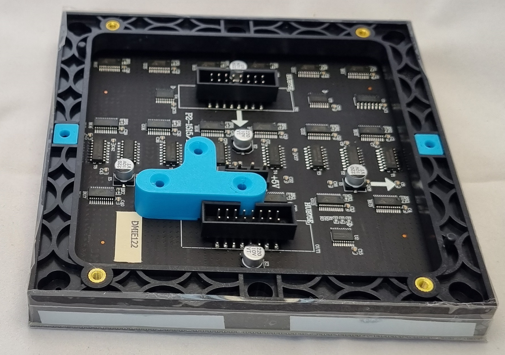

Následně přiložíme velkou dřevěnou deskou, ve které je vyříznutý otvor. Otvor přijde "nahoru". Dále si připravíma dva krátké šroubky, na které nasadíme plastové kroužky. 

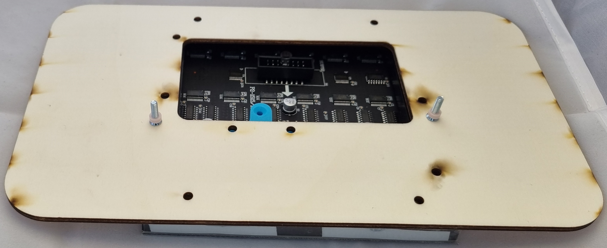

Šroubky s plastovými kroužky vložíme do otvorů v dřevěné desce a zašroubujeme. 

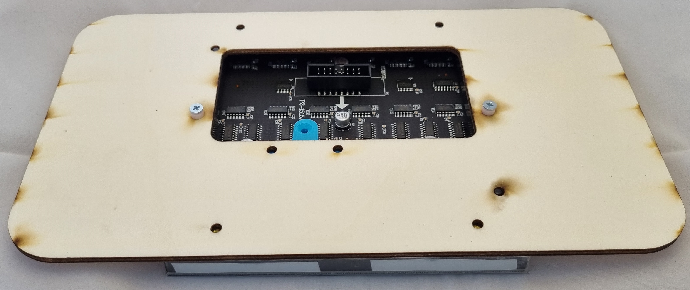

Následně vezmeme dva další stejné šroubky a přišroubujeme navolno RP-Hub holder k dřevěné desce. Není potřeba je dotahovat, protože se nám bude hodit, když se bude dát RP-Hub holder posunout. Na fotce je RP-Hub, který budeme připojovat až v sekci "spojení".

Následně si opět vezmeme nástroje na lepení. Tentokrát už nebudeme potřebovat plastový rámeček.

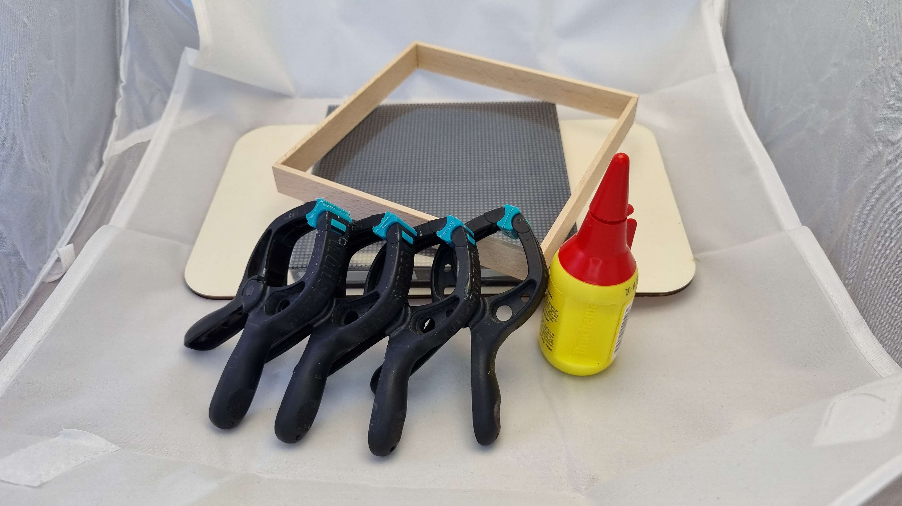

Při lepení je potřeba dávat pozor, abychom si nezašpinili displej. Jinak mi postup přijde celkem zřejmý. Dáme si jogurt.

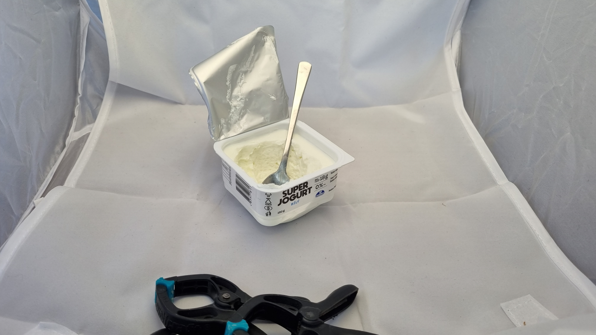

A rámeček přilepíme. 

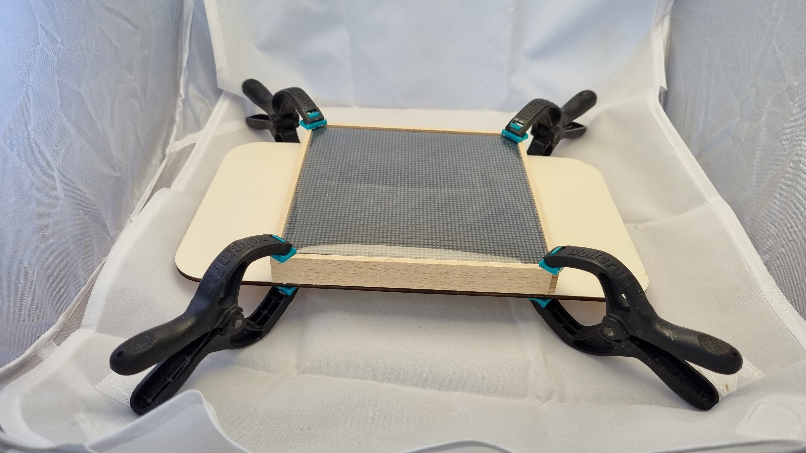

[Zpět](../index.md){ .md-button }
[Pokračovat na pájení](pajeni.md){ .md-button }
[Už mám spájeno](spojeni.md){ .md-button }